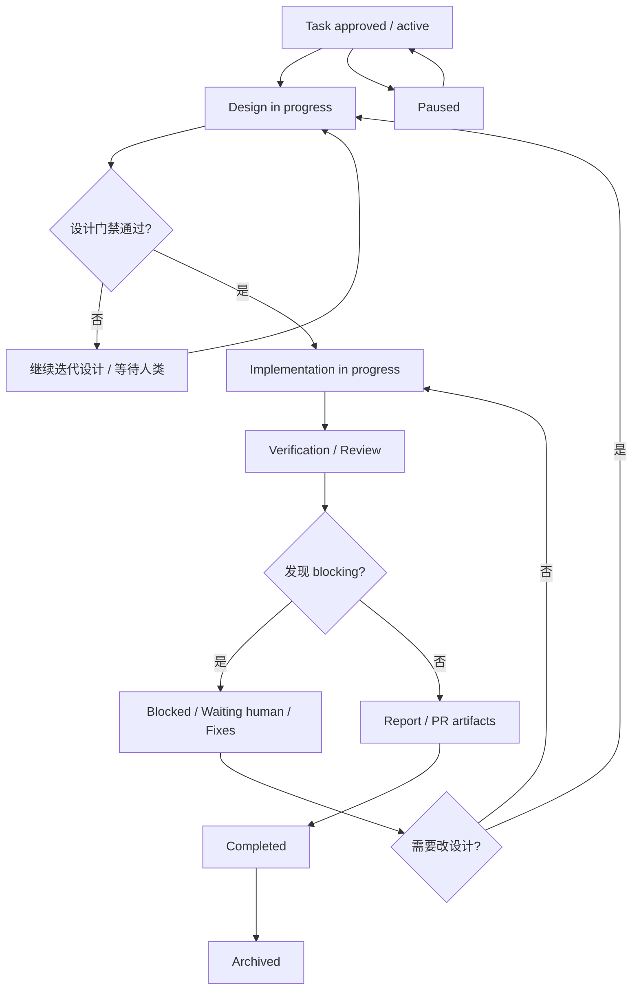

# LegionMind skill / agent 拆分方案（按 raw / wiki / schema 修正）

## 目标

把当前 `skills/legionmind` 与 `.opencode/agents/*.md` 的大一统结构，重构为：

- **skill 承载全部规则、流程、模板、输出约束**
- **agent 只承载权限定义 + 加载 skill**
- **不做任何向后兼容设计**

本方案的硬约束：

1. `.opencode/agents/*.md` 不允许继续保存 workflow、规则、模板、输出格式、检查清单。
2. agent 除 frontmatter 外，只允许出现“加载哪个 skill”的最小正文。
3. 不保留 `legionmind` 过渡层、不保留兼容 wrapper、不保留旧入口双写逻辑。
4. 拆分后每一份 reference / template 必须只有一个 owner，避免重复真源。

---

## 架构前提：先按 raw / wiki / schema 分层

根据 `docs/legion-context-management-raw-wiki-schema.md`，这次拆分不能只按“把大 skill 拆成小 skill”理解，而要先明确三层职责：

### 1) Raw Sources（任务级原始证据）

```text
.legion/tasks/<task-id>/plan.md
.legion/tasks/<task-id>/log.md
.legion/tasks/<task-id>/tasks.md
.legion/tasks/<task-id>/docs/*.md
```

这一层负责：

- 保存任务现场
- 保存设计 / 审查 / 测试 / 报告证据
- 保存当时的判断、术语、边界

它不负责成为“当前 Legion 应该怎么做”的最佳查询入口。

### 2) Schema（当前有效规则）

```text
skills/**
.opencode/agents/**
.opencode/commands/**
与 Legion 流程直接耦合的脚本 / 校验逻辑
```

这一层负责：

- 定义当前规则是什么
- 定义标准入口是什么
- 定义哪些文件 / 字段是真源
- 定义什么时候允许写回、升级、越界、追问

**这次 skill 拆分主要是在做 schema 层重构。**

### 3) Wiki / Synthesis（跨任务综合知识）

这是当前最缺的一层。它应该负责：

- 总结跨任务可复用结论
- 标记哪些规范已经 superseded
- 提供跨任务导航
- 提供“当前真相”的入口

结论：

> 仅拆 skill 还不够；如果不补 wiki / synthesis 层，查询成本和历史污染问题仍会存在。

---

## 角色与文档密度：拆分时要遵守的边界

文档不能只按文件名切，还要按读者切。

| 文档 | 主要读者 | 目标密度 |
|---|---|---|
| `plan.md` | 人类 tech lead + agent | 高层契约：目标、问题、验收、范围、关键风险、设计入口 |
| `docs/rfc.md` | agent + 需要下钻的 tech lead | 第二层设计材料：方案细节、接口、迁移、回滚、验证 |
| `log.md` | agent 为主，人类次要 | append-only 过程日志：发生了什么、为什么、下一步 |
| `tasks.md` | agent 为主 | 状态板：当前阶段、当前任务、完成状态 |
| `review-*` / `test-report.md` | agent + reviewer | 验证证据 |
| `report-walkthrough.md` / `pr-body.md` | 人类 tech lead / reviewer | 面向评审的交付摘要 |
| `legion.md` | agent | 运行时入口摘要，不是第二套 schema |

这意味着：

- `plan.md` 不是 mini-RFC，而是 **tech-lead-first 的任务契约**
- `log.md` 是正式名称，不再保留 `context.md` 作为现行文件名
- `tasks.md` 是 **状态板**，不是说明文档
- `legion.md` 只能是 **运行时壳**，不能再展开完整规则正文

---

## 目标结构

```text
skills/
  brainstorm/
    SKILL.md

  legion-docs/
    SKILL.md
    references/
      REF_SCHEMAS.md
      REF_LOG_SYNC.md
      REF_BEST_PRACTICES.md

  legion-workflow/
    SKILL.md
    references/
      REF_AUTOPILOT.md
      REF_ENVELOPE.md
      GUIDE_DESIGN_GATE.md

  spec-rfc/
    SKILL.md
    references/
      TEMPLATE_RFC_HEAVY.md
      TEMPLATE_RESEARCH.md
      TEMPLATE_IMPLEMENTATION_PLAN.md
      REF_RFC_PROFILES.md

  review-rfc/
    SKILL.md

  engineer/
    SKILL.md

  run-tests/
    SKILL.md

  review-code/
    SKILL.md

  review-security/
    SKILL.md

  report-walkthrough/
    SKILL.md
    references/
      TEMPLATE_PR_BODY_RFC_ONLY.md

.opencode/
  agents/
    legion.md
    spec-rfc.md
    review-rfc.md
    engineer.md
    run-tests.md
    review-code.md
    review-security.md
    report-walkthrough.md

.legion/
  wiki/
    index.md
    log.md
    decisions.md
    patterns.md
    maintenance.md
    tasks/
      <task-id>.md
```

说明：

- `skills/**` + `.opencode/**` 是 **schema 层**
- `.legion/tasks/**` 是 **raw 层**
- `.legion/wiki/**` 是 **wiki / synthesis 层**

如果本轮不立刻落地 `.legion/wiki/**`，至少也要把它作为后续明确 workstream，而不是继续让 `.legion/tasks/**` 兼任 wiki。

---

## Schema 层拆分原则

## 1) `legion-docs`

职责：定义 **raw task docs 应该怎么写、写到什么密度、服务谁**。

它拥有的是“文档 schema 与密度规则”，不是跨任务知识总结。

包含内容：

- `plan.md` 的职责：短、稳、面向 tech lead 的任务契约
- `log.md` 的职责：append-only 日志
- `tasks.md` 的职责：状态板 / checklist
- 三文件的 schema 与字段解释
- log sync / 更新频率
- 文档语言规则
- playbook / wiki 的沉淀入口规则
- `.legion` 文档写作 best practices

从现有内容迁入：

- `skills/legionmind/references/REF_SCHEMAS.md`
- `skills/legionmind/references/REF_CONTEXT_SYNC.md`（迁移后重命名为 `REF_LOG_SYNC.md`）
- `skills/legionmind/references/REF_BEST_PRACTICES.md`
- `skills/legionmind/SKILL.md` 里关于三文件职责、更新频率、文档语言、playbook 的内容

明确不包含：

- 风险分级
- design gate
- orchestrator 调度顺序
- subagent invocation envelope
- RFC 档位与触发条件
- RFC / review / report 模板正文

## 2) `legion-workflow`

职责：定义 **Legion 任务怎么推进**，并作为 orchestrator 的运行时规则真源。

它拥有的是“流程与调度 schema”，不是 raw docs 写作规则，也不是各 subagent 的细则全集。

包含内容：

- 任务初始化 / 恢复
- 风险分级（Low / Medium / High）
- design gate
- 何时需要 RFC、何时可以 design-lite
- orchestrator 的调用顺序
- subagent invocation envelope
- handoff / report 的流程位置
- 指向其它 subagent skill 的索引规则

还应显式拥有：

- **运行时状态转移图**：定义 task 从 design -> implementation -> verification -> report -> complete 的主路径，以及 blocked / waiting-human / redesign 回环。  
  这是 workflow schema，不是 `tasks.md` 的展示细节，也不应散落在 orchestrator agent prompt 里。

### 建议补充：`legion-workflow` 运行时状态转移图



这张图的目的不是替代 `tasks.md`，而是把“任务应该怎么推进”的控制流固定到 `legion-workflow`，避免未来再次把状态机埋回：

- `.opencode/agents/legion.md` 的 prose
- `tasks.md` 的展示格式
- 单个参考文档的局部规则

从现有内容迁入：

- `skills/legionmind/references/REF_AUTOPILOT.md`
- `skills/legionmind/references/REF_ENVELOPE.md`
- `skills/legionmind/references/GUIDE_DESIGN_GATE.md`
- `skills/legionmind/SKILL.md` 里关于恢复顺序、流程顺序、门禁与调度的内容
- `.opencode/agents/legion.md` 里的流程规则
- `.opencode/commands/legion.md` 里的执行顺序说明

明确不包含：

- `.legion` 三文件 schema 细节
- 具体 RFC 模板正文
- 测试报告模板
- PR body 模板
- 各 subagent 的完整输出协议正文

## 3) subagent skill（1:1）

每个 subagent 拥有一个同名 skill，skill 承载该角色的全部规则、输出约束、模板引用。

- `spec-rfc`
- `review-rfc`
- `engineer`
- `run-tests`
- `review-code`
- `review-security`
- `report-walkthrough`

这样 agent 与 skill 保持 1:1，避免额外映射层。

---

## 内容所有权矩阵

### `legion-docs`

拥有：

- `plan.md / log.md / tasks.md` 的角色定义与写作密度
- 三文件 schema
- log sync 规则
- 文档语言规则

不拥有：

- orchestrator 调度规则
- RFC 模板
- review / test / report 模板

### `legion-workflow`

拥有：

- 初始化 / 恢复顺序
- 风险分级
- design gate
- 调度顺序
- invocation envelope

不拥有：

- 三文件 schema 细节
- 各类产物模板正文

### `brainstorm`

拥有：

- 新 task / 重做 task contract 时的对话式澄清流程
- 方案比较与推荐
- `plan.md` / `tasks.md` 首版 seed 的收敛规则
- 何时把任务从“模糊目标”推进到“稳定契约”

不拥有：

- risk level 最终判定
- RFC 正文生成
- subagent 调度顺序
- `.legion` 三文件 schema 细节

### `spec-rfc`

拥有：

- `TEMPLATE_RFC_HEAVY.md`
- `TEMPLATE_RESEARCH.md`
- `TEMPLATE_IMPLEMENTATION_PLAN.md`
- `REF_RFC_PROFILES.md`
- RFC 正文结构、章节要求、heavy / standard 差异

### `review-rfc`

拥有：

- PASS / FAIL 结构
- Blocking / Non-blocking / 修复指导
- heavy RFC 额外检查项

### `engineer`

拥有：

- scope-first 实现规则
- 越界升级规则
- 实现阶段工作步骤
- handoff 输出约定

### `run-tests`

拥有：

- 测试命令选择启发式
- 测试报告结构
- handoff 输出约定

### `review-code`

拥有：

- 代码审查判定结构
- scope 越界直接 FAIL 的规则

### `review-security`

拥有：

- STRIDE 审查框架
- 安全 blocking 输出结构

### `report-walkthrough`

拥有：

- implementation / rfc-only 两种模式
- walkthrough 结构
- PR body 结构
- `TEMPLATE_PR_BODY_RFC_ONLY.md`

---

## agent 极简化规范

agent 文件只做两件事：

1. 定义权限
2. 加载 skill

除此之外，agent 文件里不允许再出现：

- 工作流程
- 规则列表
- 输出格式
- 设计门禁
- 审查标准
- step-by-step 指令
- 模板引用
- schema 解释

### shell 形态示例

```md
---
name: review-code
mode: subagent
description: 代码正确性/可维护性 Review
permission:
  edit:
    "*": deny
    ".legion/tasks/**/docs/*.md": allow
  webfetch: deny
---

加载 `review-code` skill 并按该 skill 执行。
```

`legion.md` 也遵循同一原则：

- frontmatter 里保留 orchestrator 所需权限
- 正文只保留“加载 `legion-workflow` skill；按需读取 `legion-docs`”这一级别的入口说明

`legion.md` 不再承担任何规则真源职责；它只能是运行时壳。

---

## 需要补上的 wiki / synthesis 层

这不是 skill 拆分本身，但它是这次方案必须显式纳入的配套项；否则 schema 层拆干净了，查询层仍然混乱。

### 建议结构

```text
.legion/
  wiki/
    index.md
    log.md
    decisions.md
    patterns.md
    maintenance.md
    tasks/
      <task-id>.md
```

### 每个 task summary 应至少包含

- task id
- 当前状态
- 风险级别
- schema generation / 模型代际
- outcome summary
- 关键可复用决策
- supersedes / superseded by
- 指向 `plan/log/tasks/rfc/review/report` 的链接

### 历史任务建议增加的轻量标记

- `historical: true`
- `schema-version: ...`
- `superseded-by: ...`

这些不是向后兼容；它们是为了把“历史快照”和“当前规范”明确分开。

### 建议补的 lint

- 新任务是否缺少 summary 页
- 历史任务是否缺少 `historical / superseded` 标记
- `plan.md` 是否缺关键 section
- `tasks.md` 是否状态漂移
- schema / docs 是否重新引用旧模型
- 关键决策是否只留在 raw docs，未进入 wiki / playbook

---

## 迁移策略（不兼容迁移）

### Phase 0：先确立三层职责

先把仓库口径统一为：

- `.legion/tasks/**` = raw
- `skills/**` + `.opencode/**` = schema
- `.legion/wiki/**` 或增强后的 playbook = wiki

不允许再把一个对象同时说成“规则真源”和“任务证据归档”。

### Phase 1：建立新 schema skill

1. 新建 `skills/brainstorm/`。
2. 新建 `skills/legion-docs/`。
3. 新建 `skills/legion-workflow/`。
4. 为每个 subagent 新建同名 skill 目录。
5. 先迁移 references / templates，再写各自 `SKILL.md`。

要求：

- skill 的 frontmatter description 必须能独立触发
- `SKILL.md` 只保留该 skill 自己的规则，不再依赖旧 `legionmind`

### Phase 2：重写 `.opencode/agents/*.md`

对所有 agent 执行统一瘦身：

- 删除正文中的全部规则
- 删除全部模板说明
- 删除全部输出格式要求
- 保留 frontmatter 权限
- 正文改成单句“加载 skill X 并按其执行”

### Phase 3：改写命令入口

更新 `.opencode/commands/*.md` 中对旧 skill / 旧规则的引用：

- 不再引用 `legionmind`
- 改为引用 `legion-workflow`
- 只有在明确涉及 `.legion` 核心文档写法时，才补充读取 `legion-docs`

### Phase 4：补 wiki / summary 层

至少落地以下之一：

- `.legion/wiki/**`
- 或增强后的 `.legion/playbook.md` + 规范化 task summary

目标：让查询路径变成：

```text
schema -> wiki index -> task summary -> raw task docs
```

而不是继续直接 grep 全部任务目录拼装结论。

### Phase 5：补历史标记与 lint

- 给旧任务补 `historical / schema-version / superseded-by`
- 给新任务补 summary 检查
- 防止旧模型回流

### Phase 6：删除旧结构

直接删除：

- `skills/legionmind/`
- 任何兼容性 wrapper
- 任何“旧 skill -> 新 skill”的重定向说明
- 任何过渡性文档

如果仓库里仍保留旧打包产物，也一并删除并重新生成新 skill 产物。

### Phase 7：全仓收口

清理所有残留引用：

- README
- docs
- commands
- agents
- scripts
- package / build 产物说明

目标是仓库中不再把 `legionmind` 当作现行 skill 使用，也不再让历史任务承担当前规范入口角色。

---

## 具体落地建议

### 建议 1：skill 名称与 agent 名称保持一致

subagent 直接 1:1：

- `spec-rfc` agent → `spec-rfc` skill
- `review-rfc` agent → `review-rfc` skill
- `engineer` agent → `engineer` skill
- `run-tests` agent → `run-tests` skill
- `review-code` agent → `review-code` skill
- `review-security` agent → `review-security` skill
- `report-walkthrough` agent → `report-walkthrough` skill

### 建议 2：`legion-docs` 与 `legion-workflow` 都属于 schema 层，但边界不同

判定标准：

- 在回答“raw task docs 应该怎么写、写成什么密度”时有用 → `legion-docs`
- 在回答“任务应该怎么推进、何时调谁、何时过门禁”时有用 → `legion-workflow`

一段内容如果同时回答两个问题，必须拆开改写，不能双重归属。

### 建议 3：reference 只保留一个 owner

- RFC 模板只属于 `spec-rfc`
- PR body RFC-only 模板只属于 `report-walkthrough`
- `.legion` 核心文档 schema 只属于 `legion-docs`
- invocation envelope 只属于 `legion-workflow`

禁止复制同一模板到多个 skill。

### 建议 4：不要把 wiki 层塞回 schema

- `legion-docs` 不负责沉淀“当前有效知识”
- `legion-workflow` 不负责总结历史任务演进
- 这些应进入 `.legion/wiki/**` 或增强后的 playbook

### 建议 5：agent shell 要能肉眼审计

每个 agent 文件应短到可以在一次屏幕内审完。

理想状态：

- frontmatter
- 1 行加载 skill 的正文

如果 agent 文件又长回几十行，就说明规则回流了。

---

## 验收标准

### 结构验收

- [ ] `skills/legionmind/` 已删除
- [ ] `skills/legion-docs/` 与 `skills/legion-workflow/` 已建立
- [ ] 每个 `.opencode/agents/*.md` 都有同名或唯一对应 skill
- [ ] 每个 template / reference 都只有一个 owner
- [ ] `.legion/tasks/**`、schema、wiki 三层职责已有明确落点
- [ ] `.legion/tasks/<task-id>/log.md` 已替代 `context.md`

### 内容验收

- [ ] `legion.md` 不再携带任何 workflow 细节
- [ ] 所有 subagent 文件不再携带规则正文
- [ ] 所有 workflow 规则都在 `legion-workflow`
- [ ] 所有 `plan/log/tasks` 写作规则都在 `legion-docs`
- [ ] 仓库现行模型中不再使用 `context.md` 命名
- [ ] 所有 RFC 规则都在 `spec-rfc`
- [ ] 所有 review 规则都在各自 review skill

### 查询与演进验收

- [ ] 不再默认把 `.legion/tasks/**` 当作当前规范查询入口
- [ ] 已存在 wiki / summary 层，或已有明确排期与结构定义
- [ ] 旧任务可被标记为 historical / superseded
- [ ] 已有 lint 方案防止旧模型回流

### 清理验收

- [ ] 仓库中不存在旧 `legionmind` 作为现行入口的说明
- [ ] 仓库中不存在兼容层、桥接层、迁移期双写说明
- [ ] 所有 command / agent / doc 引用都已经切到新 skill 体系

---

## 推荐实施顺序

1. 先确立 raw / wiki / schema 三层口径
2. 再拆 `legion-docs` / `legion-workflow`
3. 再拆 7 个 subagent skill
4. 再把 `.opencode/agents/*.md` 全量瘦身
5. 再改 `.opencode/commands/*.md`
6. 再补 wiki / task summary / lint
7. 最后删除 `skills/legionmind/` 与旧引用

这样改的好处是：

- 先分清层级，再拆真源
- 先收拢 schema，再补查询层
- 最后再做删除与收口

这比只做“把一个 skill 拆成两个 skill”更符合当前 Legion 的真实问题结构。
