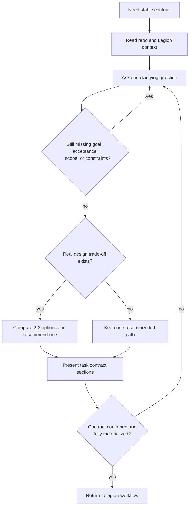

# brainstorm

## Overview

把模糊请求通过自然对话收敛成稳定的 task contract。这里的目标不是开始实现，也不是直接写 RFC，而是先把问题、范围、验收和阶段拆分讲清楚，再把它们物化进 `plan.md` 和 `tasks.md`。

<HARD-GATE>
在你已经展示 task contract 并确认它足以支撑后续阶段之前：

- 不要调用 `engineer`
- 不要写生产代码
- 不要把占位 `plan.md` / `tasks.md` 当成已经完成的 contract
- 不要把 `task create` 误判成“brainstorm 已完成”
</HARD-GATE>

## When to Use

- 当前请求没有明确恢复到既有任务目录
- 恢复后发现 contract 已漂移
- 目标、验收、范围、约束、假设、风险或阶段拆分仍不稳定
- 虽然问题大致明确，但还没有被整理成可执行的 task contract

不要用在：

- 已有稳定 contract，当前只需进入设计门或实现链
- 纯进度更新、日志追加、review 回复
- 直接写 RFC 正文；那属于 `spec-rfc`

## Core Loop

## Required Contract Fields

在物化前，至少收敛出这些字段：

- `name`
- `taskId`
- `goal`
- `problem`
- `acceptance[]`
- `assumptions[]`
- `constraints[]`
- `risks[]`
- `scope[]`
- `nonGoals[]`
- `designSummary[]`
- `phases[]`

## Materialization Rule

- 新任务：`brainstorm -> 生成人类可读 taskId -> task create`
- 已有任务：重写 `plan.md` / `tasks.md`
- 离开前必须回读 `plan.md` 与 `tasks.md`
- 若生成结果仍是摘要骨架，继续补写，直到 contract 真正落盘

## plan.md Do / Do Not

**Do:**

- 把 `plan.md` 写成面向技术 leader 的**技术概要设计**
- 保留问题定义、验收、范围、假设、约束、风险、推荐方向、阶段拆分这些高价值信息
- 明确写出 non-goals / out-of-scope，让读者知道这次**不会**解决什么
- 用摘要级语言说明为什么这样做、边界在哪里、后续如何推进
- 让读者不看实现细节，也能判断这项工作是否值得做、范围是否合理、风险是否可接受

**Do Not:**

- 不要把 `plan.md` 写成 mini-RFC 或实现手册
- 不要塞入过多技术细节，例如大段接口定义、伪代码、迁移步骤、测试矩阵、逐文件改动说明
- 不要让 `plan.md` 变成背景资料袋，混入过程日志、调试笔记、review 证据或命令输出
- 不要为了“显得完整”而堆砌实现层噪音，干扰技术 leader 对问题、边界和取舍的判断

## Process

1. 先读当前仓库和 `.legion` 状态，不要凭空发明任务背景。优先弄清当前系统已经有哪些约束、已有方案、历史决策和未解决问题，因为这些都会直接影响 task contract 的边界。
2. 一次只问一个问题，优先消除最影响设计判断的不确定性。通常先问：为什么要做、什么算完成、哪些边界不能碰、有哪些外部依赖或显式约束。不要为了“看起来高效”一次抛出一串问题。
3. 在提问过程中持续判断任务是否过大。如果它其实包含多个相对独立的子问题、多个交付阶段、或多个技术方向，先帮助拆分，再只为当前这一段收敛 contract；不要把一个过大的模糊目标硬塞进单个 task。
4. 当问题空间逐渐清晰后，把它整理成一份**面向技术 leader 的技术概要设计**。这份概要设计至少应覆盖：
   - 任务目标与问题陈述：为什么值得做，当前痛点是什么
   - 验收标准：如何判断完成，哪些结果必须可验证
   - 范围与非范围：这次明确会做什么，不做什么
   - 假设、约束、风险：哪些前提成立，哪些条件限制方案，哪里最可能出问题
   - 推荐的技术方向：采用什么路线、为什么、边界在哪里、关键 trade-off 是什么
   - 阶段拆分：后续会按什么阶段推进
5. 只有在确实存在设计分叉时，才给 2-3 个方案；否则直接给推荐方案。每个方案都要说明适用前提、主要取舍和风险，不要为了形式化而发明弱选项。
6. 不要一次性扔出整份长文。应按 section 逐步展示技术概要设计，让对方确认：问题定义是否准确、Scope 与 non-goals 是否合理、验收是否足够具体、推荐路径是否可接受。若任一 section 暴露新的关键不确定性，就回到提问阶段继续收敛。
7. 进入物化前，`confirmed` 必须满足以下其一：
   - 用户已经明确确认当前 section 或整体 contract；或
   - 上游 workflow 明确允许延迟批准，且稳定假设、边界、non-goals、推荐路径、阶段拆分已经显式写入 contract，足以支持后续阶段继续推进。
   不能把“我觉得已经差不多了”当成 confirmed。
8. 当上述概要设计已经足以支撑后续设计门或实现链时，先由上游 LLM 产出一个人类可读、ASCII-safe 的 `taskId`，再创建或改写 `.legion/tasks/<task-id>/plan.md` 与 `tasks.md`。`plan.md` 应承载这份技术概要设计的摘要版真源，`tasks.md` 承载阶段与 checklist 初稿；它们不能只是初始化骨架。尤其要控制 `plan.md` 的密度：保留技术 leader 需要的判断信息，去掉会制造噪音的实现细节。
9. 本地对话可走显式批准；若上游 workflow 明确允许延迟批准，也必须把稳定假设、边界、non-goals、推荐路径和阶段拆分显式写入 contract，不能只停留在聊天记录里。
10. 物化后必须立刻回读 `plan.md` 与 `tasks.md`，检查它们是否已经形成清晰、可读、面向技术 leader 的任务契约，而不是只剩字段清单或摘要骨架。
11. 完成后交回 `legion-workflow`：由它决定 Low / Medium / High、design-lite / RFC、以及后续 subagent 调度。

## Must Not

- 不要把 brainstorming 变成 RFC 正文
- 不要用占位 plan 假装 contract 已经存在
- 不要一次抛给用户整份长文而不收窄关键不确定性
- 不要把还未确认的背景、约束或偏好写死进 contract
- 不要把 `plan.md` 写得细到让人需要穿过实现噪音才能看清任务边界
- 不要遗漏 non-goals，让后续阶段在隐式 scope 上自行扩张
- 不要把 `taskId` 留给 CLI 临时生成；命名属于上游 LLM/编排层职责

## Return Conditions

- 用户引入新的关键约束：继续留在 `brainstorm`
- 发现当前 task 其实包含多个独立子系统：先拆 scope，再继续 `brainstorm`
- 需要正式设计门：交回 `legion-workflow`，进入 `spec-rfc`

## Common Rationalizations

| Excuse | Reality |
|---|---|
| "需求已经很清楚，可以跳过" | 当前请求没有恢复到既有任务目录时，入口路径就是 `brainstorm`。 |
| "先建 task 容器，后面再补" | 容器不是 contract。 |
| "先让 engineer 做起来更快" | 没有稳定 contract 的实现只会制造漂移。 |
| "先把整份设计一次性讲完" | `brainstorm` 要靠逐步确认收敛，不是长文轰炸。 |
| "把所有技术细节都塞进 plan 更完整" | 过细的实现信息会制造噪音；`plan.md` 只保留技术概要设计。 |
| "我觉得已经够清楚了，可以直接物化" | `confirmed` 必须来自明确确认或显式延迟批准条件，不是主观感觉。 |

## Red Flags

- 还没收敛 acceptance 就开始 task materialization
- `plan.md` 只有摘要骨架
- 用 RFC 细节替代 contract 摘要
- 一次问多个问题，导致问题空间继续发散
- `plan.md` 开始出现实现手册、测试矩阵或大段迁移步骤
- `plan.md` 没写 non-goals / out-of-scope

## References

- 主干路由：`legion-workflow`
- 文档落点：`legion-docs`
- 设计阶段：`spec-rfc`
