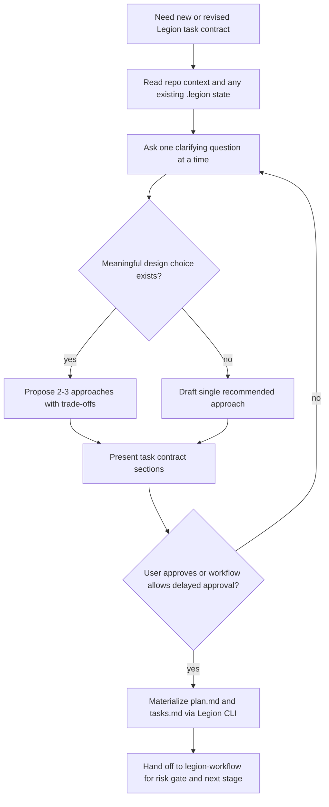

# brainstorm

## Overview

用对话把模糊任务收敛成稳定的 task contract。`plan.md` 和 `tasks.md` 的第一版应该来自这一步的澄清与方案比较，而不是来自占位模板。

<HARD-GATE>
在 task contract 收敛前，不要调用 `engineer`，不要写生产代码，也不要把占位 `plan.md` / `tasks.md` 当成已完成设计。
</HARD-GATE>

## When to Use

- 新建 Legion task，且问题定义/验收/范围还不清楚
- 已有 task，但 `plan.md` / `tasks.md` 仍是占位内容或需要大改
- 任务存在多种可能方案，需要先比较 trade-off
- 需要把实现前的稳定假设、Scope 和阶段划分固定下来

不要用在：

- 纯进度更新、日志追加、review 回复
- 已有稳定 task contract、现在只需进入实现/验证阶段
- 直接写 RFC 正文；那属于 `spec-rfc`

## Decision Flow

## Required Output

你必须先收敛出一个 task seed，再去创建或改写 `.legion` 文档。最低字段：

- `name`
- `goal`
- `rationale` / `problem`
- `acceptance[]`
- `assumptions[]`
- `constraints[]`
- `risks[]`
- `points[]`
- `scope[]`
- `designIndex`
- `designSummary[]`
- `phases[]`

这些字段用于生成：

- `plan.md`：问题定义、验收、假设/约束/风险、范围、设计索引、阶段概览
- `tasks.md`：阶段与 checklist 初稿

## Process

1. 先读当前仓库和 `.legion` 状态，不要凭空发明任务背景。
2. 一次只问一个问题，优先问：目的、约束、成功标准、边界。
3. 只有在确实存在设计分叉时，才给 2-3 个方案；否则直接给推荐方案。
4. 先展示 task contract，再创建或改写 `.legion/tasks/<task-id>/plan.md` 与 `tasks.md`。
5. 本地对话可走显式批准；若上游 workflow 明确允许延迟批准，也必须把稳定假设显式写入 contract。
6. 完成后交回 `legion-workflow`：由它决定 Low / Medium / High、design-lite / RFC、以及后续 subagent 调度。

## CLI Materialization

- 新任务：优先使用 `propose` / `proposal approve` 或 `task create`，并传入已收敛的 contract 字段
- 已有任务：优先使用 `plan update`、`tasks update`，必要时补 `docs/rfc.md` 入口
- `.legion` 文档写法细节不在本 skill 里定义；需要时读取 `legion-docs`

## Common Mistakes

- 先创建占位 `plan.md`，之后再慢慢补
- 直接把 `rationale` 当成完整问题定义
- 没有比较方案就锁定设计
- 还没收敛 Scope 就让 `engineer` 开始实现
- 把 brainstorming 变成 RFC 写作；RFC 正文应交给 `spec-rfc`

## References

- 需要 risk / design gate / orchestration 规则时，读 `legion-workflow`
- 需要 `.legion` 文档归属与密度规则时，读 `legion-docs`
- 需要写 RFC / research / implementation-plan 时，交给 `spec-rfc`
