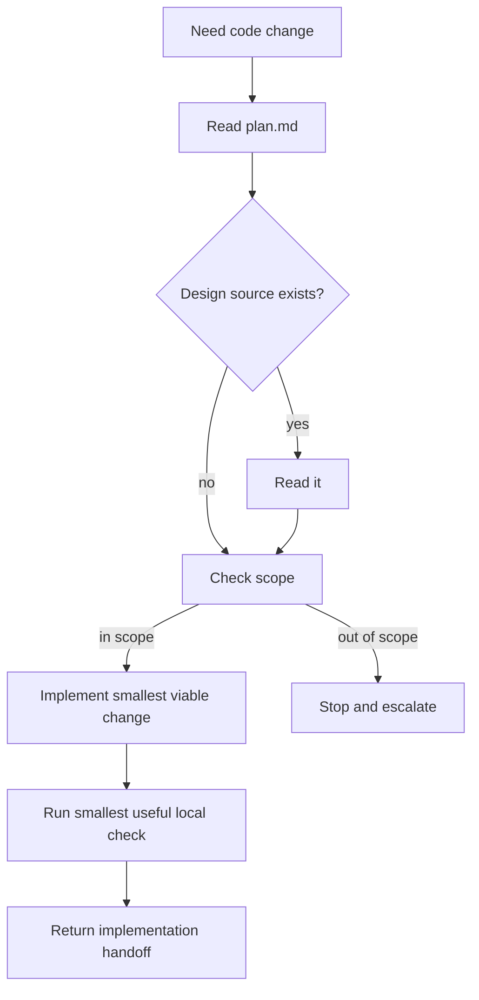

# engineer

## Overview

`engineer` 只负责在已批准范围内完成实现。它要优先把核心路径做对，而不是顺手扩边、重写 contract、或代替后续验证/审查阶段。

## Hard Gate

- 必须已有稳定 `plan.md`
- 若存在 RFC 或 design source，必须先读
- contract 未稳定或设计门未过，不得编码

## When to Use

- 已有批准 contract
- 所需设计门已通过
- 需要在明确 scope 内实现代码

不要用在：

- 还在收敛问题定义时
- 需要先出 RFC 时

## Core Loop

## Must Not

- 不要顺手改 scope 外文件
- 不要在这里重写 contract
- 不要把验证阶段的大工作偷渡进来

## Return Conditions

- scope 不够：退回 `brainstorm` / `spec-rfc`
- 设计前提不成立：退回 `spec-rfc`
- 实现完成：交给 `verify-change`

## Common Rationalizations

| Excuse | Reality |
|---|---|
| "顺手把旁边也改了更干净" | scope 外改动先升级，不要偷渡。 |
| "RFC 大概知道，不用读" | 设计真源存在时必须先读。 |
| "测试我这里一并做完就行" | `engineer` 只做最小本地检查，正式验证属于 `verify-change`。 |

## Red Flags

- 没读 `plan.md` 就开工
- 发现设计文档存在却没读
- 用大重构替代最小增量
