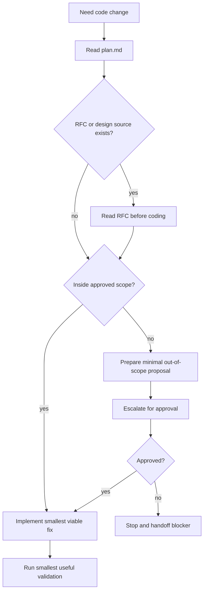

# engineer

## Overview

先读任务契约，再读设计真源，然后在 scope 内把核心路径做对，再补边界与最小验证。不要为了完成一个局部任务顺手扩边重构。

## When to Use

- 已有批准的任务契约 / 设计入口
- 需要在明确 scope 内实现代码
- 需要把实现结果整理成最小 handoff 包

## Decision Flow

## Quick Reference

- 先读 `plan.md`；只要存在 RFC / design source，就先读它再编码
- scope 是硬边界；越界先升级
- 先核心路径，再边界，再测试
- 不改 `.legion` 三文件

## Common Mistakes

- 顺手改 scope 外文件
- 没读 RFC / design source 就直接开工
- 直接大重构，而不是先交付核心增量
