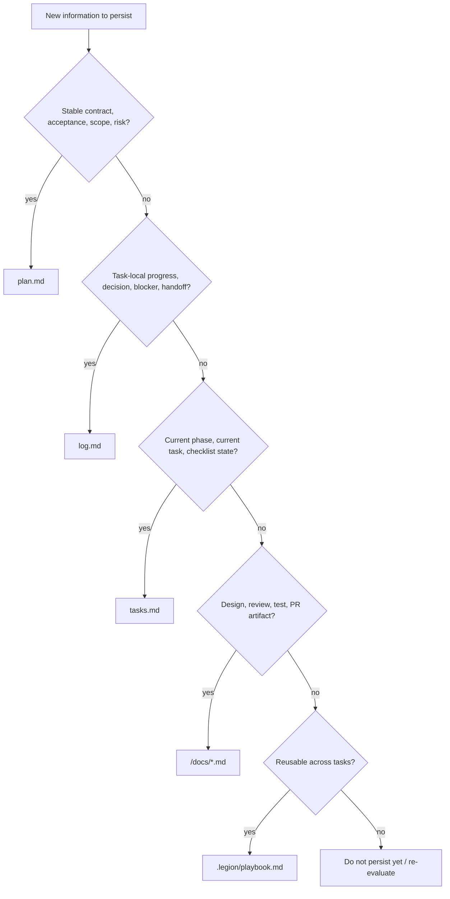

# legion-docs

## Overview

`.legion/tasks/**` 是 raw evidence，不是跨任务 wiki。核心约束是：`plan.md` 管契约，`log.md` 管过程，`tasks.md` 管状态，`docs/*.md` 管设计与验证产物。

## When to Use

- 需要新建或改写 `.legion/tasks/**` 文档
- 需要判断某条信息该写进 `plan.md`、`log.md`、`tasks.md` 还是 `docs/*.md`
- 需要检查 `log.md` 命名、文档密度、handoff 质量

不要用在风险分级、design gate、subagent 调度；那些属于 `legion-workflow`。

## Decision Flow

## Quick Reference

- `plan.md`：面向 tech lead 的任务契约；短、稳、摘要级
- `log.md`：append-only 过程日志 / 决策 / handoff
- `tasks.md`：状态板；只保留阶段、当前任务、完成状态
- `<taskRoot>/docs/*.md`：RFC、review、test-report、walkthrough、pr-body

| Information type | Best home |
|---|---|
| 验收标准、范围、风险边界 | `plan.md` |
| 本轮决策、今日进展、阻塞、handoff | `log.md` |
| 当前阶段、当前任务、checklist 状态 | `tasks.md` |
| rollback 细节、测试输出、review 证据、PR 摘要 | `docs/*.md` |
| 跨任务复用规则 | `.legion/playbook.md` |

Within `docs/*.md`:

- rollback / migration / alternatives / verification design → `docs/rfc.md` 或附录
- failing command output / executed command / pass-fail summary → `docs/test-report.md`
- reviewer-facing delivery summary → `docs/report-walkthrough.md`
- short PR-ready summary → `docs/pr-body.md`

## Common Mistakes

- 把 `log.md` 写成背景资料袋
- 把 `plan.md` 扩写成 mini-RFC
- 把进度、设计、验证证据混写到同一层
- 把 rollback 细节或测试输出塞进 `log.md`，而不是写入 `docs/*.md`
- 把 task-local 决策写进 playbook，导致跨任务知识被污染

## References

- 需要看 `.legion` 三文件与目录结构时，读 [references/REF_SCHEMAS.md](./references/REF_SCHEMAS.md)
- 需要看日志同步与 handoff 归档时，读 [references/REF_LOG_SYNC.md](./references/REF_LOG_SYNC.md)
- 需要看写作节奏与质量检查时，读 [references/REF_BEST_PRACTICES.md](./references/REF_BEST_PRACTICES.md)
