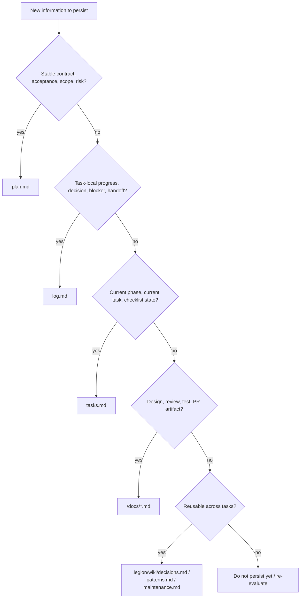

# legion-docs

## Overview

`.legion/tasks/**` 是 raw evidence，不是跨任务 wiki。核心约束是：`plan.md` 管契约，`log.md` 管过程与决定，`tasks.md` 管状态，`docs/*.md` 管设计与验证产物；跨任务可复用知识统一进入 `.legion/wiki/**`，不再单列 playbook。会话注意力摘要内嵌于既有阶段证据，不创建平行 attention 文档。

## 输出语言与文档产物

- 默认用中文回答 `.legion` 文档落点、密度和质量判断。
- 由本 skill 创建、改写或校验的 `.legion/tasks/**` 文档产物默认使用中文，包括 `plan.md`、`log.md`、`tasks.md` 与 `docs/*.md`。
- 文件名、路径、命令、测试输出、错误原文、schema 字段和外部平台术语保持原文，必要时用中文解释。

## When to Use

- 需要新建或改写 `.legion/tasks/**` 文档
- 需要判断某条信息该写进 `plan.md`、`log.md`、`tasks.md` 还是 `docs/*.md`
- 需要检查 `log.md` 命名、文档密度、handoff 质量

不要用在风险分级、design gate、subagent 调度；那些属于 `legion-workflow`。

## Decision Flow

```mermaid
flowchart TD
    A[New information to persist] --> B{Stable contract, acceptance, scope, risk?}
    B -- yes --> P[plan.md]
    B -- no --> C{Task-local progress, decision, blocker, handoff?}
    C -- yes --> L[log.md]
    C -- no --> D{Current phase, current task, checklist state?}
    D -- yes --> T[tasks.md]
    D -- no --> E{Design, review, test, PR artifact?}
    E -- yes --> DOC[<taskRoot>/docs/*.md]
    E -- no --> F{Reusable across tasks?}
    F -- yes --> W[.legion/wiki/decisions.md / patterns.md / maintenance.md]
    F -- no --> X[Do not persist yet / re-evaluate]
```

## Quick Reference

- `plan.md`：面向 tech lead 的任务契约；描述了这个任务的概要设计，不涉及具体实现细节但是要清晰展示技术决策和反响，这将是本任务最重要的 spec
- `log.md`：append-only 过程日志 / 决策 / handoff
- `tasks.md`：状态板；只保留阶段、当前检查项、完成状态
- `<taskRoot>/docs/*.md`：RFC、review、test-report、walkthrough、pr-body

| Information type                              | Best home             |
| --------------------------------------------- | --------------------- |
| 最终的技术决策、验收标准、范围、风险边界      | `plan.md`             |
| 本轮决策、今日进展、阻塞、handoff             | `log.md`              |
| 当前阶段、当前检查项、checklist 状态          | `tasks.md`            |
| rollback 细节、测试输出、review 证据、PR 摘要 | `docs/*.md`                                   |
| 跨任务复用规则 / 当前结论                     | `.legion/wiki/decisions.md` / `patterns.md` |

## 会话注意力与决定的落点

摘要 schema、四级 attention、噪音规则与恢复门禁只认 `../legion-workflow/references/REF_HUMAN_ATTENTION.md`。本 skill 只定义文档归属：

| 信息 | 唯一落点 |
|---|---|
| `review-rfc` 会话注意力摘要 | 内嵌于 `docs/review-rfc.md` 的 `## 会话注意力摘要` |
| `verify-change` 会话注意力摘要 | 内嵌于 `docs/test-report.md` 的 `## 会话注意力摘要` |
| `review-change` 会话注意力摘要 | 内嵌于 `docs/review-change.md` 的 `## 会话注意力摘要` |
| `review` 复核结果或 `decide` 决定 | 追加到 `log.md`；不得覆盖历史决定 |
| 等待复核、等待决定与恢复阶段 | 同步到 `tasks.md` 的当前状态 |
| 最终聚合 | 写入既有 `docs/report-walkthrough.md`，只引用原始证据入口 |

禁止新增 `attention.md`、独立注意力台账或平行决策文件。阶段摘要先写入对应证据，再由 sub-agent handoff 原样返回；chat session 只是同一摘要的低噪音投影。

`review` 复核结果与 `decide` 决定写入 `log.md` 时，至少记录 `decision-id`、涉及的 `claim-id` 或阶段发现、唯一问题与选项、决定人、决定时间、选择或复核结论、风险接受范围和恢复阶段。`tasks.md` 同步“等待复核 / 等待决定”或“已决定，待从 `<阶段>` 恢复”。不得仅凭 chat 中一句“继续”清除持久门禁。

如果决定改变目标、验收或 scope，先更新 `plan.md` 并重新收敛 contract；如果只改变设计、验证策略或补充专业证据，保留 contract 真源边界，按注意力协议声明的阶段恢复。

Within `docs/*.md`:

- rollback / migration / alternatives / verification design → `docs/rfc.md` 或附录
- failing command output / executed command / pass-fail summary → `docs/test-report.md`
- reviewer-facing delivery summary → `docs/report-walkthrough.md`
- short PR-ready summary → `docs/pr-body.md`

## Common Mistakes

- 把 `log.md` 写成背景资料袋
- 把 `plan.md` 扩写成 mini-RFC
- 把进度、设计、验证证据混写到同一层
- 把 rollback 细节或测试输出塞进 `log.md`，而不是写入 `docs/*.md`
- 把 task-local 决策直接提升进 wiki，导致跨任务知识被污染
- 为会话摘要新建 `attention.md`，造成阶段证据与投影结论漂移
- 只在 chat 中接受 `review` / `decide`，没有把决定与恢复点写入 `log.md` 和 `tasks.md`

## References

- 需要看 `.legion` 三文件与目录结构时，读 [references/REF_SCHEMAS.md](./references/REF_SCHEMAS.md)
- 需要看日志同步与 handoff 归档时，读 [references/REF_LOG_SYNC.md](./references/REF_LOG_SYNC.md)
- 需要看写作节奏与质量检查时，读 [references/REF_BEST_PRACTICES.md](./references/REF_BEST_PRACTICES.md)
- 需要看会话注意力摘要、噪音控制与 lifecycle 门禁时，读 [REF_HUMAN_ATTENTION.md](../legion-workflow/references/REF_HUMAN_ATTENTION.md)
