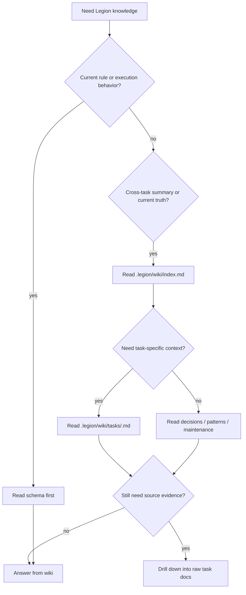

# legion-wiki

## Overview

`legion-wiki` 负责 Legion 的 **wiki / synthesis 层**。它不替代 `.legion/tasks/**` 的 raw task docs，而是把跨任务可查询知识收敛到 `.legion/wiki/**`。

raw / wiki / schema 的分工是：

- raw：`.legion/tasks/**`
- wiki：`.legion/wiki/**`
- schema：`skills/**` + `.opencode/**`

## When to Use

- 需要建立或维护 `.legion/wiki/**`
- 需要把某个 task 的结果写成稳定的 summary 页
- 需要回答“当前 Legion 的有效结论是什么”，但不想直接 grep 全部 raw task docs
- 需要把跨任务决策、模式、维护债务从 raw docs 中提升出来
- 需要标记 `historical` / `superseded-by` / `schema-version` 这类状态信息

不要用在：

- 单个 task 的执行日志、checklist、设计正文写作
- schema 规则定义本身（那属于 `legion-workflow` / `legion-docs`）

## Decision Flow



## Quick Reference

- `.legion/wiki/index.md`：总导航与查询入口
- `.legion/wiki/log.md`：wiki 层自己的更新日志
- `.legion/wiki/decisions.md`：当前有效的跨任务决策
- `.legion/wiki/patterns.md`：可复用模式
- `.legion/wiki/maintenance.md`：待迁移 / 待清理 / 待确认事项
- `.legion/wiki/tasks/<task-id>.md`：每个任务的综合摘要页

查询默认路径：

```text
schema -> wiki index -> task summary -> raw task docs
```

## Writeback Rules

- task-specific 结论先写 `tasks/<task-id>.md`
- 跨任务仍然有效的规则写 `decisions.md`
- 可复用工作方式写 `patterns.md`
- 缺口、迁移债务、历史清理需求写 `maintenance.md`
- 每次 durable writeback 后，必要时同步 `index.md` 与 `log.md`

## Common Mistakes

- 让 `.legion/tasks/**` 继续兼任 wiki
- 把 schema 规则抄进 wiki，造成第二套真源
- 只写 task summary，不把跨任务有效结论提升到 decisions / patterns
- 直接从 raw docs 回答“当前真相”，跳过 wiki 层

## References

- wiki 布局与页职责：读 [references/REF_WIKI_LAYOUT.md](./references/REF_WIKI_LAYOUT.md)
- task summary 模板：读 [references/TEMPLATE_TASK_SUMMARY.md](./references/TEMPLATE_TASK_SUMMARY.md)
- 写回规则与字段：读 [references/REF_WRITEBACK_RULES.md](./references/REF_WRITEBACK_RULES.md)
