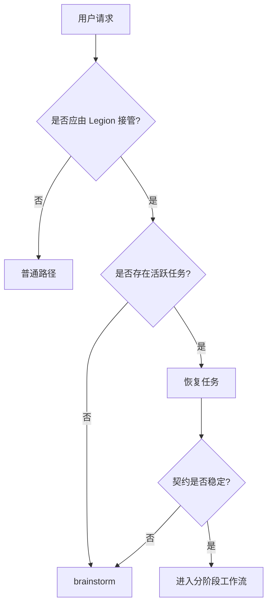
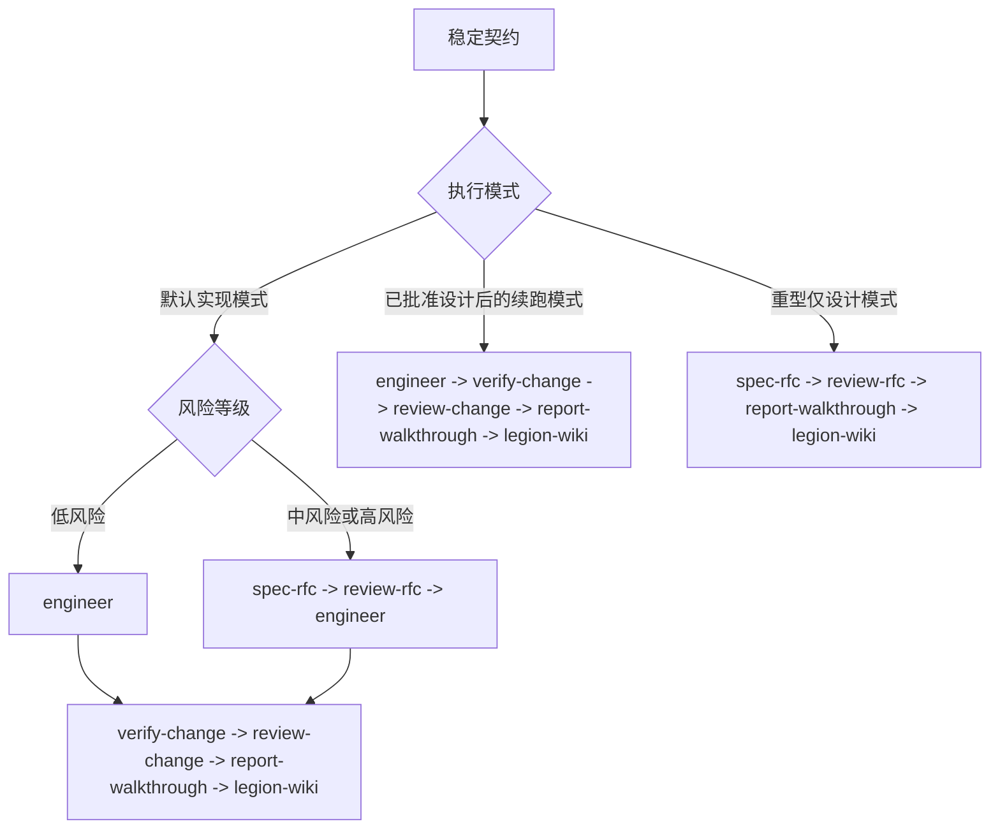

# legion-workflow

## 概览

`legion-workflow` 是唯一入口和唯一主干真源。它只负责四件事：判断 Legion 是否接管、恢复或创建任务、决定运行模式与阶段顺序、强制执行收口写回。

## 硬门禁

- 在由 Legion 管理的仓库里，任何非简单的多步骤工作都必须先过 `legion-workflow` 这一道门，再允许探索、实现或派生子代理。
- 在完成接管判断前，不要自由探索、不要开始实现、不要派生实现类 subagent。
- 没有 active task 时，默认入口永远是 `brainstorm`。
- contract 不稳定时，不得进入 `engineer`。
- 只有 `legion-workflow` 和 `SUBAGENT_DISPATCH_MATRIX.md` 可以定义运行模式与阶段顺序。

## 真源

1. `skills/legion-workflow/SKILL.md`
2. `references/SUBAGENT_DISPATCH_MATRIX.md`
3. 阶段技能：`brainstorm`、`spec-rfc`、`review-rfc`、`engineer`、`verify-change`、`review-change`、`report-walkthrough`、`legion-wiki`
4. 运行时入口包装层可以映射这些模式，但绝不能再定义另一套流程

## 适用时机

- 进入一个由 Legion 管理的仓库，并准备开始任何非简单的多步骤工作
- 需要恢复活跃任务
- 需要判断是否应先收敛任务契约、进入设计门、还是进入实现链
- 需要组织编排器到子代理的阶段推进

不要用在：

- 单轮只读问答
- 只判断 `.legion` 文档落点；那属于 `legion-docs`
- 只维护 `.legion/wiki/**`；那属于 `legion-wiki`
- 作为一个被派生出来的子代理工作时

## 入口门

## 模式切换

## 阶段规则

- `brainstorm` 负责任务契约的创建与重写。
- `spec-rfc` / `review-rfc` 负责设计门禁。
- `engineer` 负责受边界约束的实现。
- `verify-change` 负责验证证据。
- `review-change` 负责是否可交付的判断。
- `report-walkthrough` 负责面向评审者的交付摘要。
- `legion-wiki` 是强制性的收口写回阶段。
- 运行模式只决定允许的阶段链；阶段顺序仍由真源定义。

## 运行状态

- `bypass`：只读请求，或用户明确选择不进入 Legion
- `restore`：存在活跃任务；按 `plan.md -> docs/rfc.md -> log.md -> tasks.md` 的顺序恢复
- `brainstorm`：没有活跃任务，或恢复后发现契约已经漂移
- `continue`：仅在恢复成功且契约稳定后进入

## 编排器边界

编排器可以：

- 判断是否接管
- 恢复任务状态
- 写入 `.legion` 核心文件
- 选择下一阶段
- 加载 `legion-wiki` 完成收口写回

编排器不可以：

- 绕过 `spec-rfc` 临时发明设计
- 代替 `engineer` 直接实现
- 代替 `verify-change` 宣告验证完成
- 代替 `review-change` 自行批准交付

## 红旗信号

- "先快速改一下，再补 contract"
- "没有 active task 也可以直接 continue"
- "review 之后 wiki writeback 看情况再说"
- "入口包装层已经写了流程，不用看矩阵"
- "重型仅设计模式也一定要先跑 verify-change/review-change"

这些都意味着：回到入口门重新判断。

## 技能质量门

- `description`、`适用时机` 与仓库入口 shim 必须表达同一件事：`legion-workflow` 是由 Legion 管理的仓库中的强制第一道门，而不是“只有犹豫时才用”的辅助技能。
- 运行模式词汇必须在 `SKILL.md`、`SUBAGENT_DISPATCH_MATRIX.md` 与 `REF_AUTOPILOT.md` 之间保持一致；不要在 references 里重新长出命令式触发词汇。
- 历史设计文档只能标注为历史材料，不能冒充当前真源。
- 当前迭代若已暂停额外 regression harness，就不要把它们写成本 skill 的必需验证面；README 与 skill 只承认当前仍存在的验证 surface。

## 参考

- 派生真源：`references/SUBAGENT_DISPATCH_MATRIX.md`
- design gate：`references/GUIDE_DESIGN_GATE.md`
- CLI：`references/REF_TOOLS.md`
- closing writeback：`legion-wiki`
