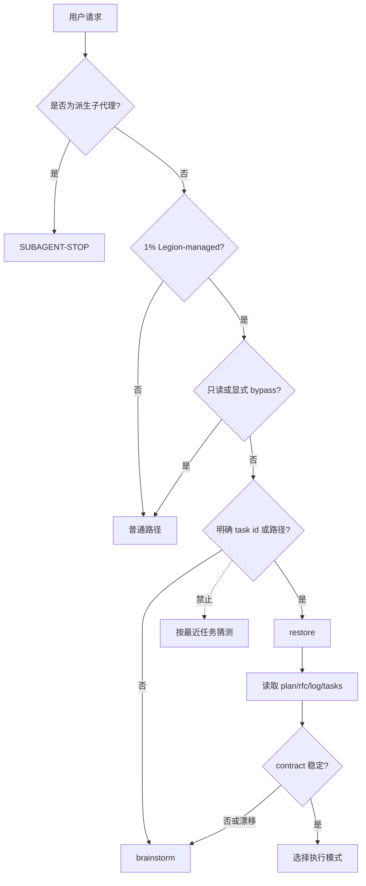
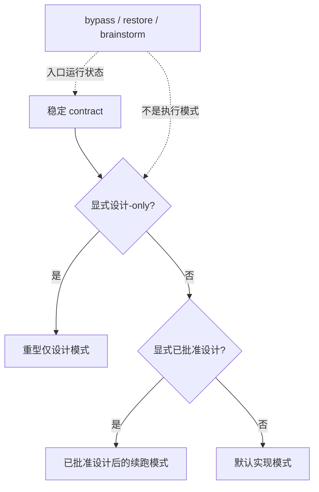
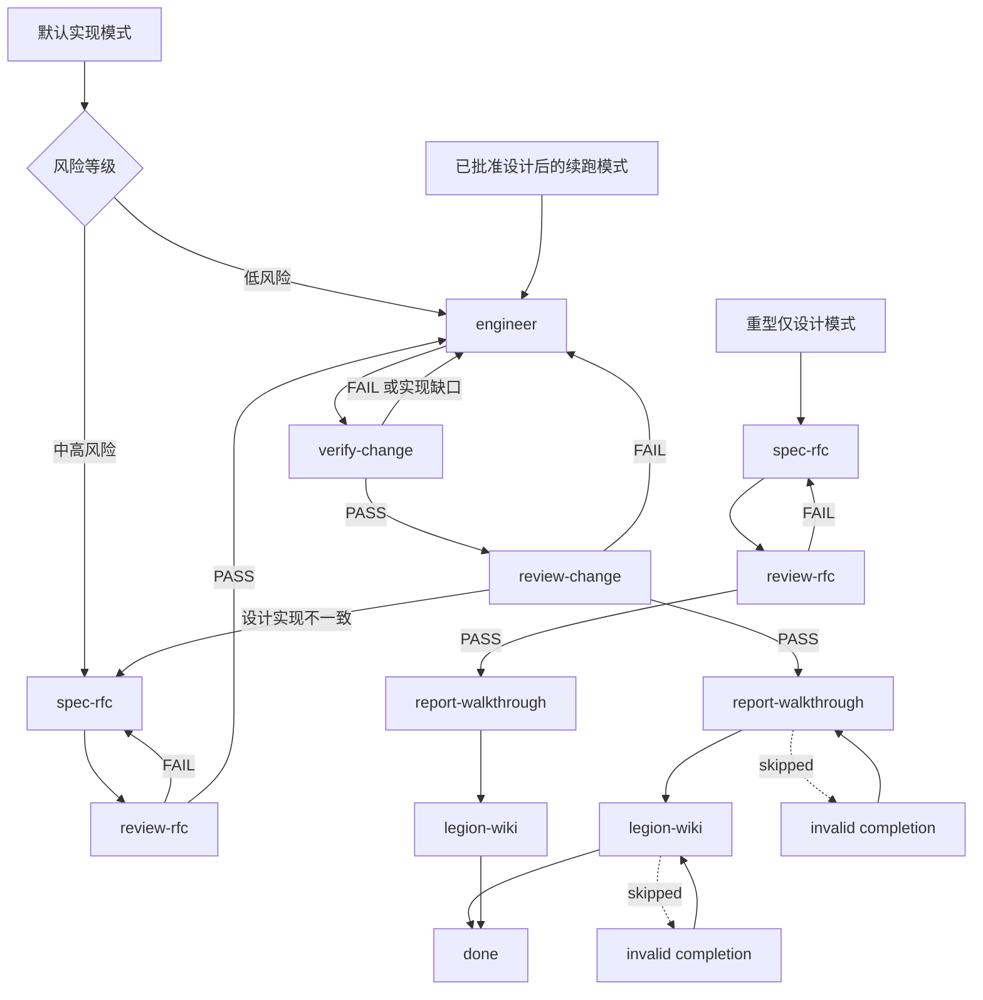

# legion-workflow

## 概览

`legion-workflow` 是 Legion 工作流的入口门禁与阶段语义真源。它只负责四件事：判断 Legion 是否接管、恢复或创建任务、决定运行模式与阶段顺序、强制执行收口写回。`skills/legion-workflow/scripts/legion.ts` 只是本地 CLI 调用方式，不拥有工作流解释权。

## EXTREMELY IMPORTANT

如果当前仓库有 **1% 可能**由 Legion 管理，并且当前请求有 **1% 可能**是非简单的多步骤工程工作，必须先运行 `legion-workflow` 入口判断，再做任何文件探索、git 探索、代码探索、实现、追问或子代理派生。

“先看一眼文件”“先跑 `git status` / `git diff`”“只是小改动”“先问个问题确认一下”都不是入口判断之前允许的准备动作；对 Legion 管理的多步骤工程工作来说，这些已经属于探索或流程决策。

指令优先级：

1. 用户显式指令（包括明确选择 bypass / 不进入 Legion）
2. Legion workflow 入口门与阶段顺序
3. Agent 默认的临场 ad-hoc 行为

用户可以显式绕过 Legion；但“快点”“直接改”“不用太麻烦”“autopilot / don’t ask me”这类通用提速表达，不等于放弃入口门、contract、设计门禁、验证、汇报或 wiki writeback。

## SUBAGENT-STOP

如果你是被派生出来的阶段子代理（例如 `engineer`、`verify-change`、`review-change`、`report-walkthrough`、`legion-wiki`），不要重新运行主 `legion-workflow` 入口门，也不要递归派生下一套 workflow。

阶段子代理必须：

- 遵循 orchestrator 传入的 task contract、scope、风险等级、设计来源和验收标准
- 只执行自己阶段的职责
- 如果收到的 contract 缺失、不稳定、越界或与设计门冲突，停止并升级给 orchestrator
- 不要自行猜测“当前任务”、不要按最近修改时间恢复任务、不要把入口状态改写成执行模式

## 硬门禁

- 在由 Legion 管理的仓库里，任何非简单的多步骤工作都必须先过 `legion-workflow` 这一道门，再允许探索、实现或派生子代理。
- 在完成接管判断前，不要自由探索、不要开始实现、不要派生实现类 subagent。
- 当前请求没有明确恢复到既有任务目录时，入口路径是 `brainstorm`。
- contract 不稳定时，不得进入 `engineer`。
- 只有 `legion-workflow` 和 `SUBAGENT_DISPATCH_MATRIX.md` 可以定义运行模式与阶段顺序。
- 阶段工作必须真实加载对应 skill 或派生对应阶段子代理；不得凭记忆模拟 `brainstorm`、`spec-rfc`、`review-rfc`、`engineer`、`verify-change`、`review-change`、`report-walkthrough` 或 `legion-wiki`。

## 真源

1. `skills/legion-workflow/SKILL.md`
2. `references/SUBAGENT_DISPATCH_MATRIX.md`
3. 阶段技能：`brainstorm`、`spec-rfc`、`review-rfc`、`engineer`、`verify-change`、`review-change`、`report-walkthrough`、`legion-wiki`
4. 运行时入口包装层可以映射这些模式，但绝不能再定义另一套流程

## 适用时机

- 进入一个由 Legion 管理的仓库，并准备开始任何非简单的多步骤工作
- 需要恢复当前请求明确指向的既有任务目录
- 需要判断是否应先收敛任务契约、进入设计门、还是进入实现链
- 需要组织编排器到子代理的阶段推进

不要用在：

- 单轮只读问答
- 只判断 `.legion` 文档落点；那属于 `legion-docs`
- 只维护 `.legion/wiki/**`；那属于 `legion-wiki`
- 作为一个被派生出来的子代理工作时

## 入口门

### Entry Checklist

按顺序机械执行，不要在完成清单前探索代码、文件或 git：

1. 判断仓库是否 Legion-managed：是否存在 `.legion/`、Legion 入口规则或本 skill 被要求加载。只要有 1% 可能，就继续本清单。
2. 判断请求是否有 1% 可能属于非简单多步骤工程工作。若是，入口门接管。
3. 判断用户是否明确选择 bypass。只有明确的“不进入 Legion / bypass Legion / 只回答不改动”才绕过；通用提速表达不绕过。
4. 判断用户是否明确给出可恢复任务目录 / task id。若没有明确恢复目标，进入 `brainstorm`，不要按 recency 猜任务。
5. 恢复任务时按 `plan.md -> docs/rfc.md -> log.md -> tasks.md` 读取；检查目标、scope、验收、风险、设计来源是否稳定。
6. contract 不稳定或漂移：停止进入实现链，加载 / 派生 `brainstorm`。
7. contract 稳定后，才选择三种执行模式之一，并按 `SUBAGENT_DISPATCH_MATRIX.md` 真实加载阶段 skill 或派生阶段子代理。
8. 实现链和设计链收口时，按适用阶段真实执行 `report-walkthrough` 与 `legion-wiki`；不要因为测试通过或上下文成本高而省略。

### 入口状态机

## 模式切换

稳定 contract 之后的执行模式**恰好只有三种**：默认实现模式（default implementation mode）、已批准设计后的续跑模式（approved-design continuation mode）、重型仅设计模式（heavy design-only mode）。不要新增第四种模式。

`bypass`、`restore`、`brainstorm` 是入口运行状态，发生在稳定 contract 之前或恢复过程中；它们不是执行模式，也不改变下面三种执行模式的阶段链。

### mode selector

### 阶段链与回退

风险等级在稳定 contract 后选择：低风险可走默认实现模式的 low-risk path；中高风险或存在跨模块、回滚、验证、设计不确定性时，先进入 `spec-rfc -> review-rfc`。风险判定与 low-risk/design-lite/fast track 边界读取 `references/GUIDE_DESIGN_GATE.md`。

终止条件不是“代码已改完”或“测试已过”，而是适用阶段链已产出证据，并完成 `legion-wiki` 写回后到达 `done`。阶段输出必须是可审阅证据（task docs、RFC、验证记录、review 结论、walkthrough、wiki writeback），不能只用聊天声明替代。

阻塞完成的情况包括：`review-rfc` FAIL、`verify-change` FAIL、实现缺口、`review-change` FAIL、设计/实现不一致、跳过 `report-walkthrough` 或跳过 `legion-wiki`。对应回退点分别是 `spec-rfc`、`engineer`、`spec-rfc -> review-rfc`，或返回缺失的 closing stage。

## 阶段规则

- `brainstorm` 负责任务契约的创建与重写。
- `spec-rfc` / `review-rfc` 负责设计门禁。
- `engineer` 负责受边界约束的实现。
- `verify-change` 负责验证证据。
- `review-change` 负责是否可交付的判断。
- `report-walkthrough` 负责面向评审者的交付摘要。
- `legion-wiki` 是强制性的收口写回阶段。
- 运行模式只决定允许的阶段链；阶段顺序仍由真源定义。
- 每个阶段都必须真实加载对应 skill 或派生对应子代理；“我记得这个 skill 怎么做”不是合规执行。

## 运行状态

- `bypass`：只读请求，或用户明确选择不进入 Legion
- `restore`：当前请求明确给出可恢复任务；按 `plan.md -> docs/rfc.md -> log.md -> tasks.md` 的顺序恢复
- `brainstorm`：当前请求没有可恢复任务，或恢复后发现契约已经漂移
- 恢复成功且契约稳定后，再进入对应的分阶段工作流；这不是独立的持久状态注册表语义

## 编排器边界

编排器可以：

- 判断是否接管
- 恢复任务状态
- 写入 `.legion` 核心文件
- 选择下一阶段
- 加载 `legion-wiki` 完成收口写回

编排器不可以：

- 绕过 `spec-rfc` 临时发明设计
- 代替 `engineer` 直接实现
- 代替 `verify-change` 宣告验证完成
- 代替 `review-change` 自行批准交付

## 红旗信号

- "先快速改一下，再补 contract"
- "当前请求没有恢复目标也可以直接 continue"
- "review 之后 wiki writeback 看情况再说"
- "入口包装层已经写了流程，不用看矩阵"
- "重型仅设计模式也一定要先跑 verify-change/review-change"

这些都意味着：回到入口门重新判断。

## 常见绕门理由与现实

| Rationalization | Reality |
|---|---|
| “我先 inspect files，了解一下再决定要不要 workflow。” | 对 Legion-managed 多步骤工程工作，读文件已经是探索；先做入口判断。 |
| “我先看 `git status` / `git diff`，不算改动。” | git 探索会影响 scope 和恢复判断；入口门之前不要先跑。 |
| “这是小改动 / 一行文档，不需要 workflow。” | 小改动可以走低风险 / design-lite / fast track；不能跳过入口门，除非用户明确 bypass。 |
| “用户说 continue last task，我按最近的 task 继续。” | 没有明确 task id/path 就不是 restore；进入 `brainstorm`，不要按 recency 猜。 |
| “用户说 autopilot / don’t ask me，所以不用门禁。” | autopilot 只减少非阻塞打扰，不跳过 contract、设计门、阶段派生、证据或写回。 |
| “测试已经通过，可以跳过 report/wiki。” | 测试结果只是验证输入；实现链仍需 `verify-change -> review-change -> report-walkthrough -> legion-wiki`。 |
| “我记得 workflow，不用加载阶段 skill。” | 阶段必须真实加载 / 派生；不能凭记忆模拟。 |
| “我是 engineer 子代理，也应该重新跑入口门。” | 阶段子代理触发 `SUBAGENT-STOP`：遵循收到的 contract/scope，缺失或不稳则升级给 orchestrator。 |

## 技能质量门

- `description`、`适用时机` 与仓库入口 shim 必须表达同一件事：`legion-workflow` 是由 Legion 管理的仓库中的强制第一道门，而不是“只有犹豫时才用”的辅助技能。
- 运行模式词汇必须在 `SKILL.md`、`SUBAGENT_DISPATCH_MATRIX.md` 与 `REF_AUTOPILOT.md` 之间保持一致；不要在 references 里重新长出命令式触发词汇。
- 历史设计文档只能标注为历史材料，不能冒充当前真源。
- 当前迭代若已暂停额外 regression harness，就不要把它们写成本 skill 的必需验证面；README 与 skill 只承认当前仍存在的验证 surface。

## 参考

- 派生真源：`references/SUBAGENT_DISPATCH_MATRIX.md`
- design gate：`references/GUIDE_DESIGN_GATE.md`
- CLI：`references/REF_TOOLS.md`
- closing writeback：`legion-wiki`
