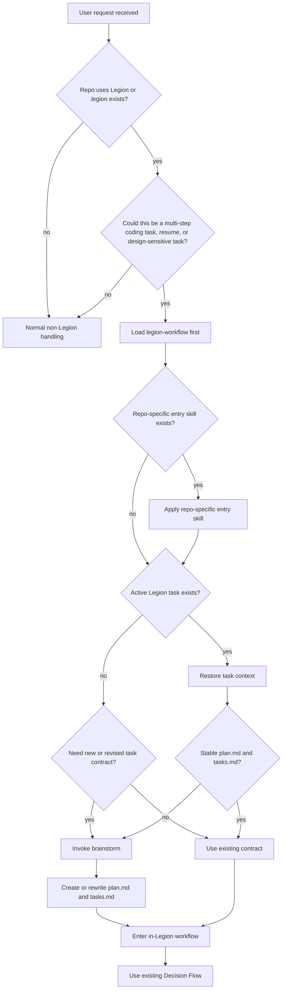
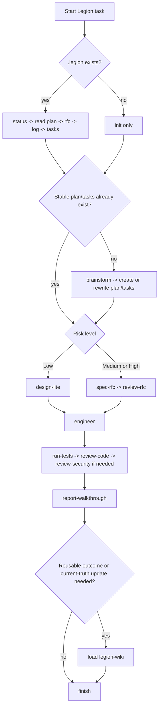
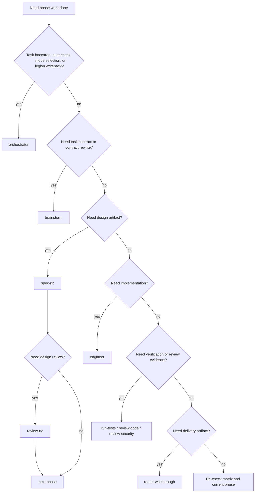

# legion-workflow

## Overview

`skills/**` + `.opencode/**` 是 Legion 的 schema 层。这里既是 Legion 的入口门禁，也是进入 Legion 之后的运行时 workflow schema。它负责先判断 Legion 是否应该接管，再决定恢复任务、先做 `brainstorm`、还是进入设计/实现链路。

若仓库还提供了 repo-specific 入口 skill（本仓库为 `agent-entry`），在加载完 `legion-workflow` 后应立即应用它，把仓库级硬门禁叠加到通用 workflow 之上。

orchestrator **必须**按阶段派生 subagents；subagent dispatch 不是可选优化，也不是 command 文案里的暗示行为。

<HARD-GATE>
在 Legion 管理的仓库里，在你完成以下检查之前，不要开始实现、不要调用 `engineer`、也不要把占位 `plan.md` / `tasks.md` 当成有效任务契约：

1. Legion 是否应当接管这个任务
2. 是否存在需要恢复的 active task
3. 当前 `plan.md` / `tasks.md` 是否已经稳定
4. 若不稳定，是否必须先运行 `brainstorm`
5. 若 Legion 已接管，是否已经按 `SUBAGENT_DISPATCH_MATRIX.md` 决定本阶段必须派生哪个 subagent
</HARD-GATE>

## When to Use

- 进入一个使用 Legion 的仓库并准备开始工作
- 仓库中已经存在 `.legion/`，需要恢复或判定当前 active task
- 需要决定如何初始化或恢复 Legion 任务
- 需要判断一个任务是否足够复杂，应该进入 Legion 而不是直接自由执行
- 处理任何可能需要持久状态、设计门禁、任务契约或结构化交接的多步骤 coding task
- 需要判断 Low / Medium / High 风险档位
- 需要决定是否先写 RFC、何时过 design gate
- 需要组织 orchestrator → subagent 的调用与 handoff
- 需要使用 Legion CLI
- 需要决定何时把 task 结果提升到 `.legion/wiki/**`

若还没有稳定的 task contract（`plan.md` / `tasks.md` 仍是占位或需要重构），先用 `brainstorm`。不要在这里直接发明任务内容。

不要用在：

- `.legion` 文档写法细节；那属于 `legion-docs`
- `.legion/wiki/**` 的页面写法与 summary 提升规则；那属于 `legion-wiki`
- 单轮、只读、无需持久化也无需交付物链的普通查询

## Before Any Action

在 Legion 管理的仓库里，在你开始探索、编辑、实现或调度 subagent 之前，先完成这 5 个判断：

1. 这个任务是否应该进入 Legion？
2. 如果应该，是否已有 active task？
3. 如果有，当前 `plan.md` / `tasks.md` 是否稳定？
4. 如果不稳定，是否应该先运行 `brainstorm`？
5. 只有在这些判断完成后，才能进入 Legion 内部流程。

若当前仓库定义了 repo-specific 入口 skill（例如 `agent-entry`），在完成这 5 个判断后、进入自由探索前，立刻应用该 skill。

## Entry Gate

## Decision Flow

## Subagent Dispatch Gate

Legion 的一个核心纪律是：**orchestrator 是门禁与路由器，不是隐式执行者。**

repo-specific 入口 skill（如 `agent-entry`）属于门禁补丁层，不替代 `legion-workflow` 的路由职责；它只负责把仓库级额外规则显式化。

- orchestrator 自己负责：
  - 判断 Legion 是否接管
  - 恢复 active task
  - 判断 contract / risk / design gate
  - 写回 `.legion` 三文件
  - 选择 mode 与 dispatch 顺序
- orchestrator 不负责：
  - 自己脑补完成设计文档
  - 自己隐式完成实现
  - 自己替代测试 / review / 报告 subagent

如果当前工作已经进入某个阶段，默认问题不是“我能不能自己顺手做掉”，而是“这个阶段按矩阵应该派生谁”。

派生顺序的唯一真源是 `references/SUBAGENT_DISPATCH_MATRIX.md`。命令文案可以声明 mode，但不能再复制另一套顺序；如果 command、agent prompt 或临场习惯与矩阵冲突，以矩阵为准。

## Red Flags

这些想法都意味着：停止当前路径，回到 `legion-workflow` 的入口判断。

| Thought | Reality |
|---|---|
| "这个任务很简单，不需要 Legion" | 简单不代表不需要任务契约、Scope 检查或恢复已有状态。 |
| "我先让 engineer 开始，后面再补 plan" | `engineer` 只能在稳定 task contract 之后运行。 |
| "我先快速改一下，再回填 `.legion`" | 这是状态漂移的起点，不是提速。 |
| "我先看看代码再决定要不要进 Legion" | 在 Legion 仓库里，应先判断 Legion 是否接管，再自由探索。 |
| "已有 `.legion`，但我先忽略它" | 现有状态必须先恢复或明确 supersede，不能绕过。 |
| "plan 先占位，之后再慢慢补" | 占位 contract 会让后续 engineer、review、report 都建立在漂移之上。 |
| "用户只是让我 fix，不需要 design / contract" | bugfix 仍可能需要 task contract、risk gate 和 structured handoff。 |
| "这个阶段我自己做一下就行，不必派 subagent" | orchestrator 只负责 gate、路由与 `.legion` 写回；阶段工作按矩阵派生。 |
| "command 已经写了流程，我不用看派生矩阵" | command 只选 mode；subagent 顺序只认 `SUBAGENT_DISPATCH_MATRIX.md`。 |

## Skill Priority

当 Legion 适用时，按这个顺序走：

1. `legion-workflow` - 决定是否接管、恢复状态、选择正确入口
2. repo-specific entry skill（如 `agent-entry`）- 应用仓库级入口补丁，但不替代主 workflow
3. `brainstorm` - task contract 不稳定、需要新建任务、或需要重构 `plan.md` / `tasks.md`
4. `legion-docs` - 决定 `.legion` 文档应该写到哪里、写到什么密度
5. `spec-rfc` / `review-rfc` - Medium / High 风险任务需要设计产物时
6. `engineer` - 只有在稳定 contract 和所需 design gate 之后
7. `run-tests` / `review-code` / `review-security`
8. `report-walkthrough`
9. `legion-wiki` - 需要把结果提升到 wiki / synthesis 层时

## Quick Reference

- 在 Legion 仓库里，`legion-workflow` 是第一道门；不要绕过它直接实现
- 若仓库存在 repo-specific 入口 skill，紧接着应用它（本仓库为 `agent-entry`）
- 恢复顺序：`plan.md` → `docs/rfc.md` → `log.md` → `tasks.md`
- task contract 不稳定时：先 `brainstorm`，再进入风险分级
- Low：design-lite；Medium / High：先收敛 RFC
- orchestrator 负责门禁、调度、写回 `.legion`
- subagent 派生是硬规则；具体顺序只认 `SUBAGENT_DISPATCH_MATRIX.md`
- subagent 只做本角色工作并返回最小 handoff
- CLI 默认入口：`skills/legion-workflow/scripts/legion.ts`
- 需要 `.legion` 文档归属规则时，再加载 `legion-docs`
- 需要 summary / 当前有效知识 / 历史状态标记时，再加载 `legion-wiki`
- repo-specific entry skill 只能补充仓库规则，不能替代 `legion-workflow`

## Common Mistakes

- 让 orchestrator 自己隐式完成设计/实现/测试/审查，而不派生 subagents
- 在 command 里复制一套 dispatch 顺序，导致多处真源漂移
- 有 RFC 却没先跑 `review-rfc` 就直接进入实现
- 绕过 `brainstorm` 直接生成占位 `plan.md` / `tasks.md`
- 在还没判断 Legion 是否接管前就开始自由实现
- 把派生矩阵当成“参考信息”，而不是运行时硬规则
- 让 raw task docs 继续兼任 wiki，而不提升到 `.legion/wiki/**`

## References

- 工作流、风险分级、阶段推进：读 [references/REF_AUTOPILOT.md](./references/REF_AUTOPILOT.md)
- subagent 派生真源：读 [references/SUBAGENT_DISPATCH_MATRIX.md](./references/SUBAGENT_DISPATCH_MATRIX.md)
- wiki / synthesis 层：加载 `legion-wiki`
- design gate：读 [references/GUIDE_DESIGN_GATE.md](./references/GUIDE_DESIGN_GATE.md)
- subagent envelope：读 [references/REF_ENVELOPE.md](./references/REF_ENVELOPE.md)
- CLI 命令：读 [references/REF_TOOLS.md](./references/REF_TOOLS.md)
- 本仓库入口覆盖规则：读 [`../agent-entry/SKILL.md`](../agent-entry/SKILL.md)
