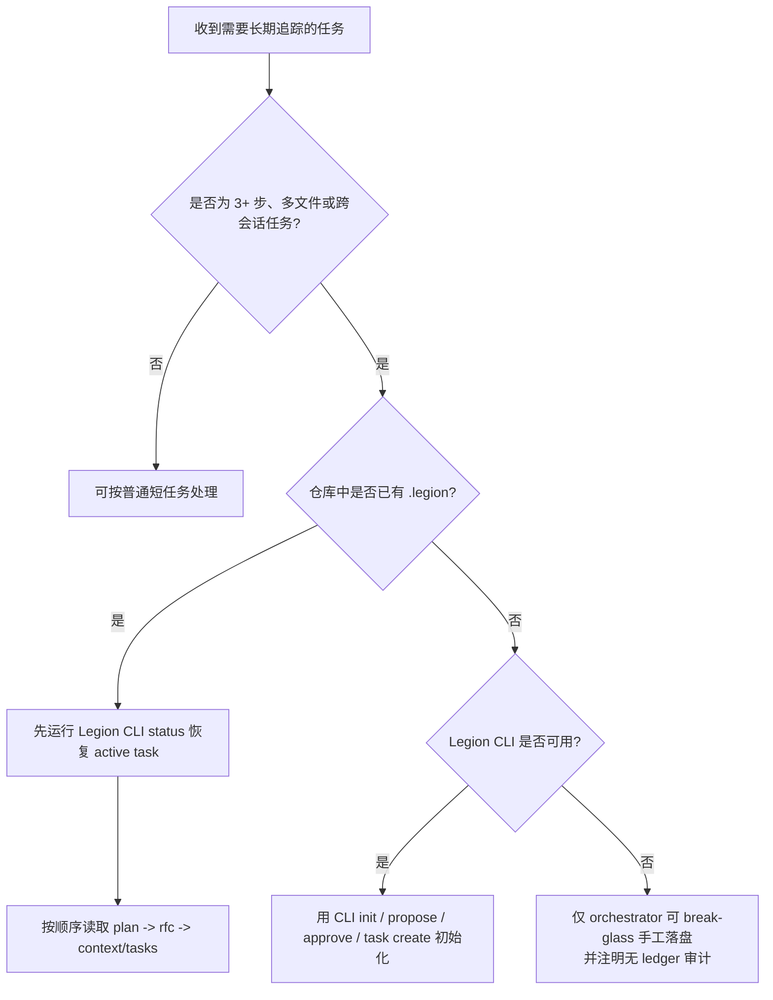

# LegionMind

## 0. 快速决策图

当你不确定现在应该“恢复已有任务”、“初始化新任务”，还是进入 break-glass 路径时，按这个小流程判断：

## 1. 核心机制

- **`plan.md` (Task Contract + Design Index)**:
  - 作为唯一的人类可读任务契约，固定问题定义、验收、假设/约束/风险、目标、要点、允许 Scope、设计索引与阶段概览。
  - 作为详细设计文档 (RFC/design-lite) 的索引/入口，但自身保持摘要级，不展开实现细节。
  - **写一次，读多次**。
  - _Schema_: [REF_SCHEMAS.md](./references/REF_SCHEMAS.md#2-planmd)

- **`context.md` (Narrative Log)**:
  - 记录"发生了什么" (Progress) 和"为什么" (Decisions)。
  - 包含 Handoff (交接) 信息，确保上下文连续性。
  - **高频追加**。
  - _Schema_: [REF_SCHEMAS.md](./references/REF_SCHEMAS.md#3-contextmd)

- **`tasks.md` (Status Tracker)**:
  - 结构化的任务清单，机器可读。
  - 必须通过 Legion CLI 更新以保持格式。
  - **高频更新**。
  - _Schema_: [REF_SCHEMAS.md](./references/REF_SCHEMAS.md#4-tasksmd)

## 2. 关键规则 (Mandatory)

1.  **设计门禁 (Design Gate)**:
    - 编码前必须有批准的设计。
    - 简单任务可走 Fast Track，但仍需创建任务条目。
    - _Guide_: [GUIDE_DESIGN_GATE.md](./references/GUIDE_DESIGN_GATE.md)

2.  **更新频率**:
    - **每 15-20 分钟** 或 **每完成一个子任务** 必须更新 `context.md` 和 `tasks.md`。
    - 严禁"做完所有事最后补文档"。
    - **集中写回（唯一默认）**：子 agent 只输出变更摘要/决策/下一步，由 orchestrator 统一运行 Legion CLI（如 `context update` / `tasks update` / `plan update`）写回。
    - **子 agent 不直接写回 `.legion` 三文件**：subagent 只产出 docs 与最小 handoff 包，避免并发污染与审计归因分叉。
    - 目标：将“更新时间”从自觉要求变成流程门禁。

3.  **Review 闭环**:
    - 用户或 Reviewer 可在任意位置插入 `> [REVIEW]` 块。
    - Agent 必须在读取上下文时解析 Review，并逐条响应。
    - `blocking` 类型的 Review 未解决前，不得推进任务。

4.  **读取顺序**:
    - 恢复任务时先读 `plan.md`，再按需读 `rfc.md`，然后读 `context.md` / `tasks.md`。
    - 如果 `plan.md` 与任务级 `config.json` 的 Scope mirror 不一致，视为 drift，需同次改动一起修复。

5.  **文档语言**:
    - LegionMind 产出的任务文档默认使用当前用户与 agent 的工作语言。
    - 若仓库已有明确文档语言约定，则遵循仓库约定。
    - 不要因为模板示例或历史小标题是英文，就把新文档默认写成英文。

## 3. 工具使用

所有文件操作建议优先使用 bundled Legion CLI，以确保 Schema 正确性和审计追踪。

- **默认入口**: `node --experimental-strip-types "${OPENCODE_HOME:-$HOME/.opencode}/skills/legionmind/scripts/legion.ts" <command> ...`
- **创建/初始化**: `init`, `propose --json '{...}'`, `proposal approve --proposal-id <id>`
- **查询**: `status [--task-id <id>]`, `context read [--task-id <id>]`, `review list`
- **更新**: `tasks update --json '{...}'`, `context update --json '{...}'`, `plan update --json '{...}'`, `review respond`

_完整工具列表见 [REF_TOOLS.md](./references/REF_TOOLS.md)_

## 4. Meta Feedback

如果发现本 Skill 流程设计有问题，请使用 `legion::meta` 触发反馈模式，将建议写入 `FEEDBACK.md`。

## 5. Playbook（跨任务沉淀，推荐）

- 将可复用模式/策略沉淀到 `.legion/playbook.md`。
- 记录来源任务与日期，便于追溯。
- 若 CLI 暂不可用，仅 orchestrator 可在 break-glass 模式下使用 `Write` / `Edit` 追加；并在 `context.md` 的“关键文件”登记，同时注明无 ledger 审计。

---

_更多资源：_

- [REF_BEST_PRACTICES.md](./references/REF_BEST_PRACTICES.md)
- [REF_CONTEXT_SYNC.md](./references/REF_CONTEXT_SYNC.md)
- [REF_ENVELOPE.md](./references/REF_ENVELOPE.md)
- [REF_AUTOPILOT.md](./references/REF_AUTOPILOT.md)
- [REF_RFC_PROFILES.md](./references/REF_RFC_PROFILES.md)
