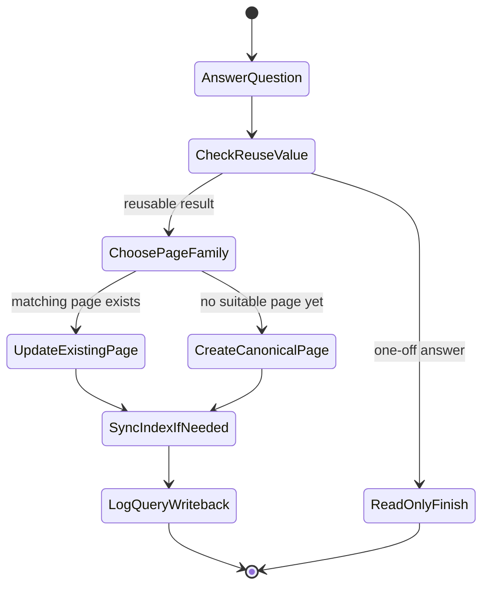
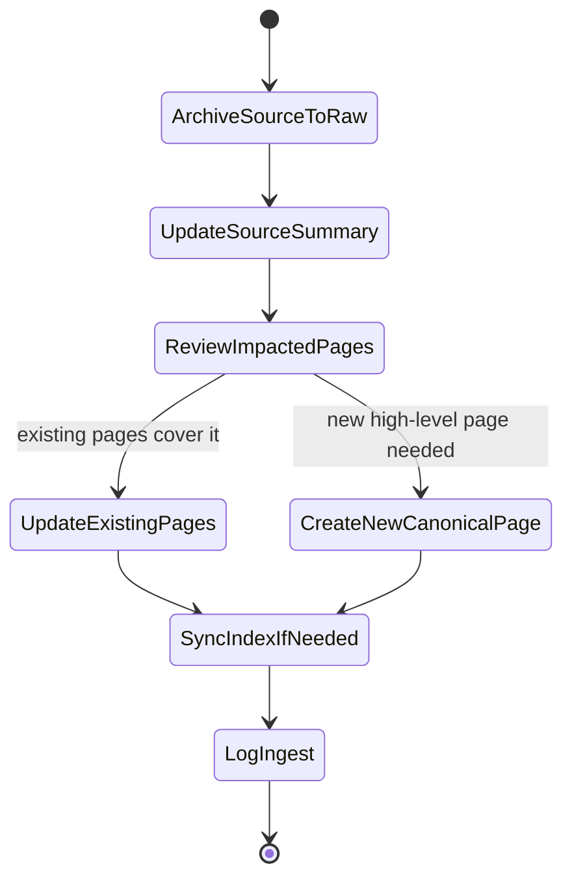

# llm-wiki

1. 把授权给你的 wiki 目录当作**完全由本 skill 管理**的知识库根目录。
2. 把 `raw/` 当作只读输入层；raw source 可以被读取、引用、重命名整理进 `raw/`，但不能改写内容。
3. 只使用一套 canonical layout：根目录固定有 `index.md`、`log.md`，页面只落在固定 page families。
4. 不创建替代导航 / 日志机制、替代目录树或额外 durable artifact 类型；归档结果一律写成 markdown 页面并放回 canonical wiki 结构。
5. 默认 index-first：先读 `index.md`，再读相关页面、source summary 与 raw source；搜索只用于定位，不作为事实来源。
6. 始终区分来源事实、wiki 综合判断与 `needs-verification` 项。

## canonical layout

- 根目录固定包含：`raw/`、`sources/`、`entities/`、`topics/`、`comparisons/`、`overviews/`、`maintenance/`、`index.md`、`log.md`。
- `maintenance/backlog.md` 是默认维护入口。
- 目录还没规范化时，先把它整理到这套结构，再做深入 ingest / query writeback / lint。
- 所有持久化写回都留在这个根目录里；不要把结论散落到其他路径或其他文件格式。

## 操作入口

- **bootstrap**：创建或规范化 canonical layout，补齐 `index.md`、`log.md`、`maintenance/backlog.md`，并建立当前页面清单。
- **ingest**：把新 source 放进 `raw/`，创建或更新对应的 source summary，然后回查并更新受影响的 `entities/`、`topics/`、`comparisons/`、`overviews/`、`maintenance/` 页面。
- **query**：先回答问题；如果答案具有复用价值（如稳定比较、综合结论、重复会被问到的解释、结构性缺口），就在结束前把它写回 canonical page family。
- **lint**：检查事实冲突、陈旧结论、孤儿页、缺失 source summary、过载页面与 maintenance debt，并按 canonical 规则修复或记账。

## durable writeback 规则

- **应写回**：能帮未来会话少做一次重新综合的结果。
- **不必写回**：一次性、局部、不会复用的聊天回答。
- 优先更新已有页面，而不是制造近似重复的新页面。
- 在 `topics/`、`comparisons/`、`overviews/`、`maintenance/` 之间拿不准时，先读 [references/page-types.md](./references/page-types.md)。

## 决策流程图

把下面 Mermaid 图当成**执行状态机**来读：它们不是装饰，而是 query / ingest 时的最小决策骨架。

### query：回答后是否写回 wiki

- `reusable result` 指稳定比较、跨 source 综合、很可能会再次被问到的解释，或应落入 `maintenance/` 的结构性缺口。

### ingest：source 进入后如何扇出更新

- ingest 不能停在 `sources/`；必须回查 `entities/`、`topics/`、`comparisons/`、`overviews/`、`maintenance/`。

## query 默认输出

1. 答案
2. 关键依据
3. 冲突 / 不确定性
4. 下一步 wiki 动作

## 读取导航

- 需要理解固定目录结构与规范化规则时，读 [references/canonical-layout.md](./references/canonical-layout.md)
- 需要理解三层职责与复利式维护模型时，读 [references/architecture.md](./references/architecture.md)
- 需要判断页面该落在哪类、何时创建 / 更新时，读 [references/page-types.md](./references/page-types.md)
- 需要执行 bootstrap / ingest / query / lint 的标准步骤与自检时，读 [references/workflows.md](./references/workflows.md)
- 需要维护命名、citation、日志、状态标记与互链规则时，读 [references/conventions.md](./references/conventions.md)
