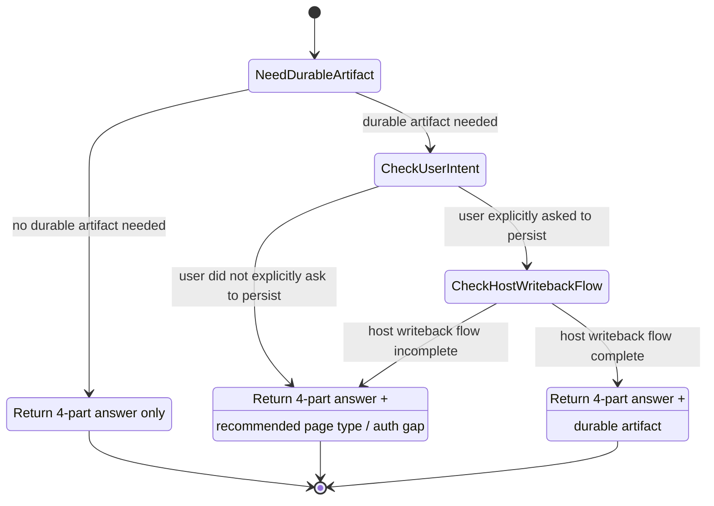
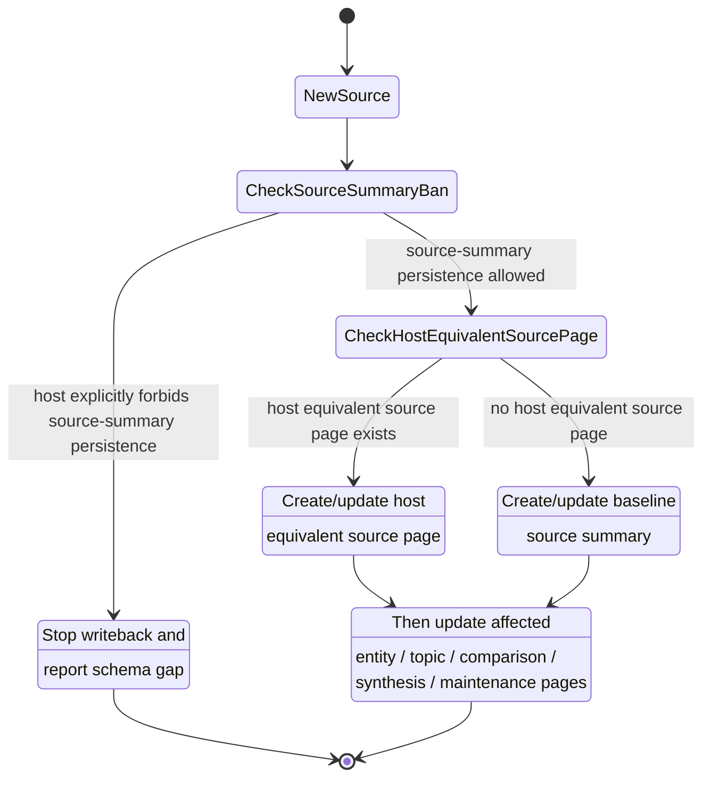

# llm-wiki

1. 把 raw sources 视为只读输入层；只从中读取证据，不回写、不改写。
2. 把 wiki 视为 LLM 维护层；持续更新页面、互链、综合结论与待验证项。
3. 把 schema 视为规则层；先做 host-schema handshake，确认 raw/wiki 根、命名、frontmatter、写权限，以及 `index.md` / `log.md` 或宿主声明的等价导航 / 日志机制；只有当宿主显式声明其职责、目标位于可写 scope、且允许字段与写法已定义时，才允许写回。
4. 默认 index-first：先读 `index.md`（或宿主等价导航机制）再定位页面；只有当宿主明确允许且导航不足时，才把搜索作为增强而不是新的事实来源。
5. durable writeback 只发生在 ingest、authorized query writeback、lint maintenance 这三类受控动作；query 默认严格只读。
6. 将聊天内容、推测与来源事实分开；证据不足时写成待确认，而不是确定性结论。

## session bootstrap

- 首次接管时，先盘点宿主 schema 是否明确声明：source 位置、wiki 根、页面家族、命名规则、citation 形式、写回权限、维护页落点，以及导航 / 日志的等价机制、可写 scope、允许字段与写法。
- 若宿主缺少这些关键信息，采取保守基线：只读 query、最少新增页面、显式报告缺失的 schema 点。
- 页面落点先按推荐 page family 思考，再由宿主 schema 覆盖；不要把 baseline 当成强制目录树。

## 操作入口

- **bootstrap**：先完成 schema 盘点与读取入口确认，决定本次使用默认 `index.md` / `log.md` 还是宿主等价机制。
- **ingest**：按单 source 或小批次处理；先产出 source summary，再更新 entity / topic / comparison / synthesis / maintenance 等受影响页面；同步更新导航与追加日志。
- **query**：默认严格只读。先基于导航机制找页，再综合回答。仅当“用户明确要求沉淀 + 宿主 schema 显式定义写回流程”同时满足时，才允许把结论落为 durable artifact；结构化回答、建议 page type、或沉淀建议都不构成授权；否则只返回答案或沉淀建议。durable artifact 可以是 wiki page，也可以是 table / slide deck / chart / canvas 等宿主允许的输出；但输出载体不天然等于 wiki page type，是否写回 wiki 仍受宿主写回流程约束。
- **lint**：检查事实冲突、结构缺口与维护债务；优先输出 issue list、建议动作与必要 maintenance 更新，而不是静默重写结论。

## 决策流程图

把下面 Mermaid 图当成**执行状态机**来读：只有命中转移条件，agent 才能进入可写状态；否则必须退回只读、建议沉淀，或报告 schema 缺口。

### query 三岔路

- 只有明确的持久化指令（如“把它写进 wiki / 沉淀成页面”）才算 `user explicitly asked to persist`；“这个值得记录”“以后可以整理”之类提示都仍归入 `SuggestPersist`。

### ingest 第一落点

## query 输出默认格式

- 1) 答案
- 2) 关键依据
- 3) 冲突与不确定性
- 4) 缺口与下一步

## 读取导航

- 需要理解三层职责、首次接管 checklist、宿主覆盖边界与可选增强时，读 [references/architecture.md](./references/architecture.md)
- 需要判断页面该落在哪类、何时创建 / 更新时，读 [references/page-types.md](./references/page-types.md)
- 需要执行 bootstrap / ingest / query / lint 的标准步骤与自检时，读 [references/workflows.md](./references/workflows.md)
- 需要维护导航 / 日志等价机制、citation、状态标记、命名、互链与冲突处理时，读 [references/conventions.md](./references/conventions.md)
