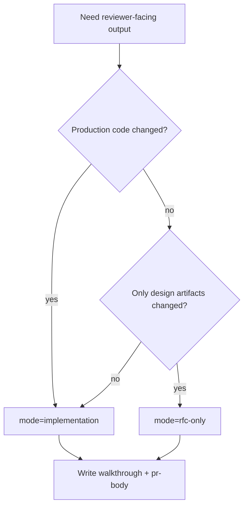

# report-walkthrough

## Overview

把现有设计、实现、review、测试材料重新组织成 reviewer 易扫读的交付摘要。不要在这里重新发明设计或补跑验证。

## When to Use

- 需要输出 `report-walkthrough.md`
- 需要输出可直接贴到 PR 的 `pr-body.md`
- 需要在 implementation 与 rfc-only 两种 reviewer 视角之间切换

## Decision Flow

## Quick Reference

- 默认 `implementation`
- 仅设计 PR 用 `mode=rfc-only`
- walkthrough 讲范围、设计、改动、验证、风险、下一步
- PR body 保持短，突出 What / Why / How、Testing、Risk / Rollback、Links

## References

- RFC-only PR 模板：读 [references/TEMPLATE_PR_BODY_RFC_ONLY.md](./references/TEMPLATE_PR_BODY_RFC_ONLY.md)
