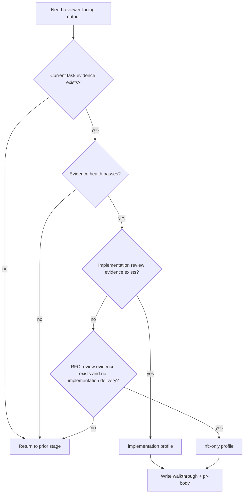

# report-walkthrough

## Overview

`report-walkthrough` 是 Legion 收口链里的 reviewer-facing evidence translator。它只把当前 task 已有、有效、通过前置阶段的证据整理成 reviewer 易扫读的交付说明；它不补设计、不补验证、不替代 `review-change` / `review-rfc`，也不替代 `legion-wiki` 或 PR lifecycle。

## Hard Gate

- 必须已有当前 task 的实现产物或设计产物。
- 必须已有与当前 walkthrough profile 对应的前置证据。
- 前置证据必须是当前有效证据：属于当前 task、对应当前交付状态、结论不是 FAIL / blocked / stale。
- 交付摘要必须引用已有证据，而不是重新发明结论。
- `pr-body.md` 只是 PR 创建/更新的输入材料，不代表 PR 已创建、checks 已过、review 已处理、PR 已 merged 或 lifecycle 已完成。

## When to Use

- 需要 `report-walkthrough.md`
- 需要 `pr-body.md`
- 需要在 implementation 和 rfc-only 两种 reviewer 输出视角之间切换

不要用在：

- 证据还没齐的时候
- 需要补测试、补设计、补 review 的时候
- 需要完成 wiki writeback 或 PR lifecycle 的时候

## Walkthrough Profiles

这里的 profile 只是 reviewer 文档输出视角，不是 `legion-workflow` 的 execution mode，也不能新增第四种流程模式。

| Profile | 使用条件 | 不要误判为 |
|---|---|---|
| `implementation` | 已有实现结果、验证证据与 `review-change` | 不是只有 production code 变化才算；docs/config/test/script-only 实现交付也可以是 implementation |
| `rfc-only` | 本次只交付设计产物，已有 RFC 与 RFC review | 不是“没有 production code 改动”的默认兜底 |

## Decision Flow



## Entry Evidence Matrix

| Profile | Required evidence | Conditional evidence |
|---|---|---|
| `implementation` | `plan.md`; implementation handoff or changed files; `docs/test-report.md`; `docs/review-change.md` | If design gate exists: `docs/rfc.md` and `docs/review-rfc.md` |
| `rfc-only` | `plan.md`; `docs/rfc.md`; `docs/review-rfc.md` | PR body should state that merge means design approval, not implementation completion |

## Evidence Health Check

Before writing reviewer-facing output, check every evidence file you rely on:

- It belongs to the current task root, not another task.
- It corresponds to the current delivery state or current diff, not an old attempt.
- Review evidence is PASS or PASS with non-blocking suggestions; FAIL / blocked evidence stops this stage.
- Verification evidence is not skipped-only and does not record unresolved implementation gaps.
- Every completion claim in the walkthrough has a cited evidence source.
- If evidence is stale, ambiguous, missing, or contradictory, do not smooth it over; return to the stage that should regenerate that evidence.

## Exit Evidence

- `docs/report-walkthrough.md`
- `docs/pr-body.md`
- explicit profile note: `implementation` or `rfc-only`

## Report Walkthrough Structure

Use this minimum structure for `docs/report-walkthrough.md`. Write the body in the task's required document language; in this repository, task documents are normally Chinese.

```md
# Report Walkthrough

## Profile
implementation | rfc-only

## Reviewer Summary
- ...

## Scope
In scope:
Out of scope:

## Evidence Map
| Claim | Evidence | Status |
|---|---|---|

## What Changed / What Was Decided
...

## Verification / Review Status
...

## Risks and Limits
...

## Reviewer Checklist
- [ ] ...

## Next Stage
交给 `legion-wiki`；若处于 PR-backed lifecycle，`pr-body.md` 仅作为 PR 创建/更新输入。
```

## PR Body Templates

- implementation profile: use `references/TEMPLATE_PR_BODY_IMPLEMENTATION.md`.
- rfc-only profile: use `references/TEMPLATE_PR_BODY_RFC_ONLY.md`.

Both templates are inputs to PR creation or update only. They do not prove that the PR was opened, checks passed, review completed, auto-merge enabled, worktree cleaned, or the main workspace refreshed.

## Must Not

- 不要在这里补跑测试
- 不要在这里重新写设计方案
- 不要把未验证 claim 写成既成事实
- 不要把 FAIL / blocked / stale evidence 包装成 ready-to-merge 摘要
- 不要因为没有 production code 变化就自动选择 rfc-only profile
- 不要把 `pr-body.md` 写成 PR lifecycle 已完成的证据

## Return Conditions

- implementation profile 缺 `docs/test-report.md`：退回 `verify-change`
- implementation profile 缺 `docs/review-change.md`：退回 `review-change`
- `docs/review-change.md` 为 FAIL / blocked：退回 `engineer` 或对应修复阶段
- design gate exists 但缺 `docs/rfc.md` / `docs/review-rfc.md`：退回 `spec-rfc` / `review-rfc`
- rfc-only profile 缺 `docs/rfc.md` / `docs/review-rfc.md`：退回 `review-rfc`
- `docs/review-rfc.md` 为 FAIL / blocked：退回 `spec-rfc`
- evidence stale、非当前 task、或与当前 diff 不一致：退回生成该证据的前置阶段
- walkthrough 完成后：交给 `legion-wiki`

## Common Rationalizations

| Excuse | Reality |
|---|---|
| "边写 walkthrough 边把缺的 testing 补了" | walkthrough 只重组证据，不补证据。 |
| "design-only 也照 implementation 模板写就行" | 两种 profile 的输入证据不同，必须显式区分。 |
| "先写结论，后面再找引用" | reviewer-facing 文档必须从已有 evidence 出发。 |
| "没有 production code 变化，所以就是 rfc-only" | profile 取决于阶段链和证据，不取决于 production code 是否变化。 |
| "PR body 写好了，所以 PR 交付完成" | PR body 只是 lifecycle 输入；完成仍由 `git-worktree-pr` 的 PR 终态、checks/review、cleanup 和 refresh 决定。 |

## Red Flags

- 没标明当前 profile
- implementation profile 缺 `test-report.md`
- implementation profile 缺 `review-change.md`
- rfc-only profile 缺 `review-rfc.md`
- evidence health check 没做或结果含糊
- 在 walkthrough 里发明未被验证的结论
- 把 blocked handoff 写成 ready-to-merge delivery

## References

- Implementation PR 模板：`references/TEMPLATE_PR_BODY_IMPLEMENTATION.md`
- RFC-only PR 模板：`references/TEMPLATE_PR_BODY_RFC_ONLY.md`
