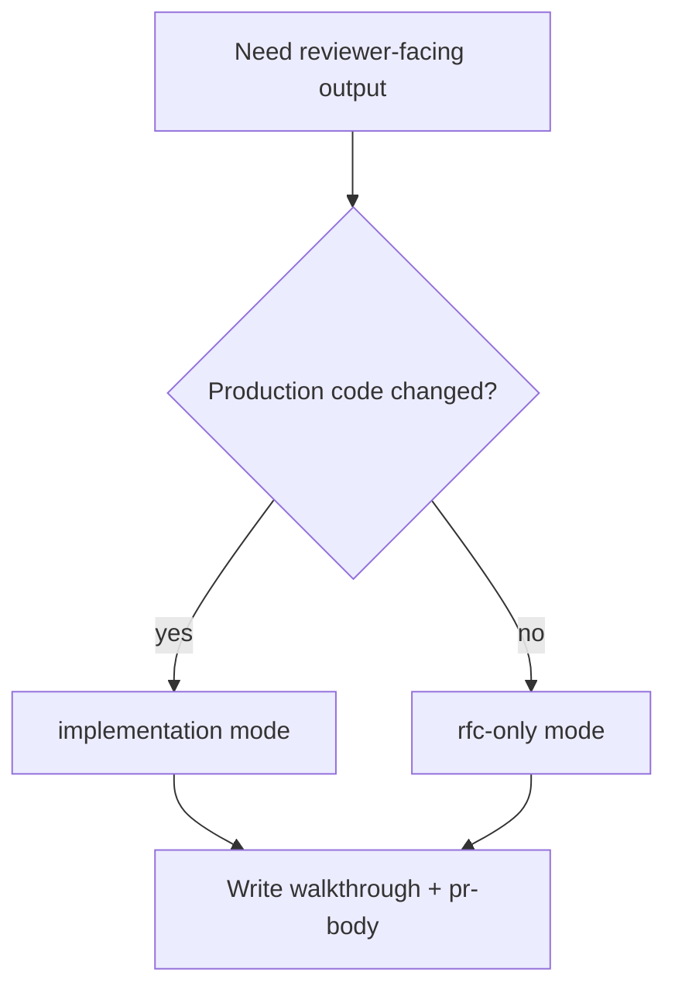

# report-walkthrough

## Overview

`report-walkthrough` 只重新组织已有产物，生成 reviewer 易扫读的交付摘要。它不补设计、不补验证，也不替代 wiki writeback。

## Hard Gate

- 必须已有实现产物或设计产物
- 必须已有与当前 mode 对应的前置证据
- 交付摘要必须引用已有证据，而不是重新发明结论

## When to Use

- 需要 `report-walkthrough.md`
- 需要 `pr-body.md`
- 需要在 implementation 和 rfc-only 两种 reviewer 视角之间切换

不要用在：

- 证据还没齐的时候
- 需要补测试、补设计、补 review 的时候

## Decision Flow

## Entry Evidence

- implementation mode:
  - implementation handoff
  - `docs/test-report.md`
  - `docs/review-change.md`
- rfc-only mode:
  - `docs/rfc.md`
  - `docs/review-rfc.md`

## Exit Evidence

- `docs/report-walkthrough.md`
- `docs/pr-body.md`
- explicit mode note: `implementation` or `rfc-only`

## Must Not

- 不要在这里补跑测试
- 不要在这里重新写设计方案
- 不要把未验证 claim 写成既成事实

## Return Conditions

- implementation mode 缺少 test/review evidence：退回 `verify-change` / `review-change`
- rfc-only mode 缺少 design review evidence：退回 `review-rfc`
- walkthrough 完成后：交给 `legion-wiki`

## Common Rationalizations

| Excuse | Reality |
|---|---|
| "边写 walkthrough 边把缺的 testing 补了" | walkthrough 只重组证据，不补证据。 |
| "design-only 也照 implementation 模板写就行" | 两种 mode 的输入证据不同，必须显式区分。 |
| "先写结论，后面再找引用" | reviewer-facing 文档必须从已有 evidence 出发。 |

## Red Flags

- 没标明当前 mode
- implementation mode 缺 `test-report.md`
- rfc-only mode 缺 `review-rfc.md`
- 在 walkthrough 里发明未被验证的结论

## References

- RFC-only PR 模板：`references/TEMPLATE_PR_BODY_RFC_ONLY.md`
