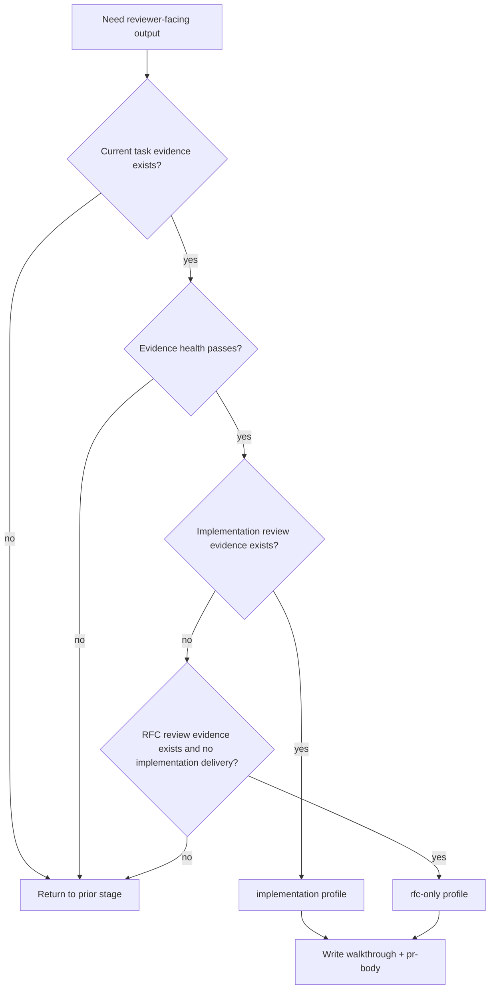

# report-walkthrough

## Overview

`report-walkthrough` 是 Legion 收口链里的 reviewer-facing evidence translator。它只把当前 task 已有、有效、通过前置阶段的证据整理成 reviewer 易扫读的交付说明；它不补设计、不补验证、不替代 `review-change` / `review-rfc`，也不替代 `legion-wiki` 或 PR lifecycle。

默认输出是 HTML-first：`docs/report-walkthrough.html` 是主 reviewer artifact，`docs/report-walkthrough.md` 是 compact source / fallback，`docs/pr-body.md` 是 PR 创建或更新输入。PR-backed walkthrough 的 HTML artifact 完成后，默认交给 `pr-html-render` 形成 rendered preview path，或记录显式 render bypass / blocker。

## Hard Gate

- 必须已有当前 task 的实现产物或设计产物。
- 必须已有与当前 walkthrough profile 对应的前置证据。
- 前置证据必须是当前有效证据：属于当前 task、对应当前交付状态、结论不是 FAIL / blocked / stale。
- 交付摘要必须引用已有证据，而不是重新发明结论。
- HTML walkthrough 必须是 self-contained single file，不依赖外部 CDN、字体、脚本或图片。
- `report-walkthrough` 只生成 HTML artifact，不发布 preview、不写 CI workflow、不创建 PR comment；这些属于 `pr-html-render` 的后续渲染职责。
- `pr-body.md` 只是 PR 创建/更新的输入材料，不代表 PR 已创建、checks 已过、review 已处理、PR 已 merged 或 lifecycle 已完成。

## When to Use

- 需要 `report-walkthrough.md`
- 需要 `report-walkthrough.html`
- 需要 `pr-body.md`
- 需要在 implementation 和 rfc-only 两种 reviewer 输出视角之间切换

不要用在：

- 证据还没齐的时候
- 需要补测试、补设计、补 review 的时候
- 需要完成 wiki writeback 或 PR lifecycle 的时候

## Walkthrough Profiles

这里的 profile 只是 reviewer 文档输出视角，不是 `legion-workflow` 的 execution mode，也不能新增第四种流程模式。

| Profile | 使用条件 | 不要误判为 |
|---|---|---|
| `implementation` | 已有实现结果、验证证据与 `review-change` | 不是只有 production code 变化才算；docs/config/test/script-only 实现交付也可以是 implementation |
| `rfc-only` | 本次只交付设计产物，已有 RFC 与 RFC review | 不是“没有 production code 改动”的默认兜底 |

## Decision Flow



## Entry Evidence Matrix

| Profile | Required evidence | Conditional evidence |
|---|---|---|
| `implementation` | `plan.md`; implementation handoff or changed files; `docs/test-report.md`; `docs/review-change.md` | If design gate exists: `docs/rfc.md` and `docs/review-rfc.md` |
| `rfc-only` | `plan.md`; `docs/rfc.md`; `docs/review-rfc.md` | PR body should state that merge means design approval, not implementation completion |

## Evidence Health Check

Before writing reviewer-facing output, check every evidence file you rely on:

- It belongs to the current task root, not another task.
- It corresponds to the current delivery state or current diff, not an old attempt.
- Review evidence is PASS or PASS with non-blocking suggestions; FAIL / blocked evidence stops this stage.
- Verification evidence is not skipped-only and does not record unresolved implementation gaps.
- Every completion claim in the walkthrough has a cited evidence source.
- If evidence is stale, ambiguous, missing, or contradictory, do not smooth it over; return to the stage that should regenerate that evidence.

## Exit Evidence

- `docs/report-walkthrough.html`：主 reviewer-facing artifact
- `docs/report-walkthrough.md`
- `docs/pr-body.md`
- explicit profile note: `implementation` or `rfc-only`
- render handoff note for PR-backed tasks: rendered preview URL, artifact/internal-host fallback, or explicit render bypass / blocker for `pr-html-render`

## Communication Pass

Before writing the HTML artifact, do a clean-doc style selection pass:

- Reader: name the reviewer, maintainer, technical lead, or decision maker.
- Situation: state what they need to decide or inspect now.
- Main path: put conclusion, profile, scope, evidence, verification, risk, and final state before secondary history.
- Evidence selection: include only details that change approval, risk awareness, or next action.
- Certainty levels: separate facts, review results, assumptions, risks, limits, and next steps.

If a detail is only background, link it from the evidence map or raw docs instead of expanding it in the HTML.

## HTML Walkthrough Requirements

`docs/report-walkthrough.html` is the primary walkthrough output. It must follow `references/TEMPLATE_REPORT_WALKTHROUGH_HTML.md` unless the task has a stronger project-specific design system.

Required qualities:

- Standalone semantic HTML: `<!doctype html>`, `lang`, viewport, meaningful `header` / `main` / `nav` / `section` / `table` structure.
- Product evidence interface: optimize for fast reviewer judgment, not decorative branding.
- OKLCH colors; do not use `#000` or `#fff`.
- No gradient text, side-stripe accent borders, decorative glassmorphism, hero-metric cliché, or identical card grids.
- No em dash characters in copy.
- Responsive layout and print-friendly CSS.
- Prominent final state or next stage near the top.
- Evidence map and delivery path must be visible, not buried.
- PR lifecycle disclaimer must remain explicit when relevant.
- For PR-backed tasks, include the render handoff state if known: `pr-html-render` pending, rendered URL, artifact-only/internal-host fallback, or explicit bypass/blocker.

## Report Walkthrough Structure

Use this minimum structure for both `docs/report-walkthrough.html` and the compact Markdown source/fallback. Write the body in the task's required document language; in this repository, task documents are normally Chinese.

```md
# Report Walkthrough

## Profile
implementation | rfc-only

## Reviewer Summary
- ...

## Scope
In scope:
Out of scope:

## Evidence Map
| Claim | Evidence | Status |
|---|---|---|

## What Changed / What Was Decided
...

## Verification / Review Status
...

## Risks and Limits
...

## Reviewer Checklist
- [ ] ...

## Next Stage
若处于 PR-backed lifecycle，先把 `docs/report-walkthrough.html` 交给 `pr-html-render` 渲染或记录显式 bypass/blocker；之后交给 `legion-wiki`。`pr-body.md` 仅作为 PR 创建/更新输入。
```

## PR Body Templates

- HTML walkthrough template: use `references/TEMPLATE_REPORT_WALKTHROUGH_HTML.md`.
- rendered PR preview handoff: use `pr-html-render` after the HTML artifact exists.
- implementation profile: use `references/TEMPLATE_PR_BODY_IMPLEMENTATION.md`.
- rfc-only profile: use `references/TEMPLATE_PR_BODY_RFC_ONLY.md`.

Both templates are inputs to PR creation or update only. They do not prove that the PR was opened, checks passed, review completed, auto-merge enabled, worktree cleaned, or the main workspace refreshed.

## Must Not

- 不要在这里补跑测试
- 不要在这里重新写设计方案
- 不要把未验证 claim 写成既成事实
- 不要把 FAIL / blocked / stale evidence 包装成 ready-to-merge 摘要
- 不要因为没有 production code 变化就自动选择 rfc-only profile
- 不要只生成 Markdown 而跳过 HTML walkthrough，除非明确记录 HTML artifact 被用户或环境显式 bypass
- 不要把 HTML 写成依赖外部资源的网页应用
- 不要在 walkthrough 阶段补 preview workflow、发布 rendered URL 或创建 PR comment；交给 `pr-html-render`
- 不要把 `pr-body.md` 写成 PR lifecycle 已完成的证据

## Return Conditions

- implementation profile 缺 `docs/test-report.md`：退回 `verify-change`
- implementation profile 缺 `docs/review-change.md`：退回 `review-change`
- `docs/review-change.md` 为 FAIL / blocked：退回 `engineer` 或对应修复阶段
- design gate exists 但缺 `docs/rfc.md` / `docs/review-rfc.md`：退回 `spec-rfc` / `review-rfc`
- rfc-only profile 缺 `docs/rfc.md` / `docs/review-rfc.md`：退回 `review-rfc`
- `docs/review-rfc.md` 为 FAIL / blocked：退回 `spec-rfc`
- evidence stale、非当前 task、或与当前 diff 不一致：退回生成该证据的前置阶段
- HTML walkthrough 缺少 evidence map、delivery path、final state / next stage、或 PR lifecycle disclaimer：补齐 walkthrough artifact 后再继续
- PR-backed walkthrough 缺 rendered preview path 且没有 explicit render bypass / blocker：交给 `pr-html-render`，不要在本 skill 中补发布逻辑
- walkthrough 完成后：交给 `legion-wiki`

## Common Rationalizations

| Excuse | Reality |
|---|---|
| "边写 walkthrough 边把缺的 testing 补了" | walkthrough 只重组证据，不补证据。 |
| "design-only 也照 implementation 模板写就行" | 两种 profile 的输入证据不同，必须显式区分。 |
| "先写结论，后面再找引用" | reviewer-facing 文档必须从已有 evidence 出发。 |
| "没有 production code 变化，所以就是 rfc-only" | profile 取决于阶段链和证据，不取决于 production code 是否变化。 |
| "PR body 写好了，所以 PR 交付完成" | PR body 只是 lifecycle 输入；完成仍由 `git-worktree-pr` 的 PR 终态、checks/review、cleanup 和 refresh 决定。 |
| "Markdown 已经够清楚，不需要 HTML" | 默认是 HTML-first；Markdown 是 source / fallback，不是主 reviewer artifact。 |
| "HTML 好看就行" | HTML 必须先服务 reviewer 判断，且每个完成性 claim 都要能回到 evidence。 |
| "HTML 文件已经生成，reviewer 自己下载就行" | PR-backed walkthrough 默认需要 `pr-html-render` 形成 rendered preview path，除非有显式 bypass 或 blocker。 |

## Red Flags

- 没标明当前 profile
- implementation profile 缺 `test-report.md`
- implementation profile 缺 `review-change.md`
- rfc-only profile 缺 `review-rfc.md`
- evidence health check 没做或结果含糊
- 缺 `docs/report-walkthrough.html`，但没有显式 bypass 记录
- HTML 依赖外部资源，或违反 OKLCH / no gradient text / no side-stripe / no em dash 等质量门
- 在 walkthrough 里发明未被验证的结论
- 把 blocked handoff 写成 ready-to-merge delivery
- PR-backed HTML artifact 没有 rendered preview path，也没有 explicit render bypass / blocker

## References

- HTML walkthrough 模板：`references/TEMPLATE_REPORT_WALKTHROUGH_HTML.md`
- Rendered PR preview：`pr-html-render`
- Implementation PR 模板：`references/TEMPLATE_PR_BODY_IMPLEMENTATION.md`
- RFC-only PR 模板：`references/TEMPLATE_PR_BODY_RFC_ONLY.md`
