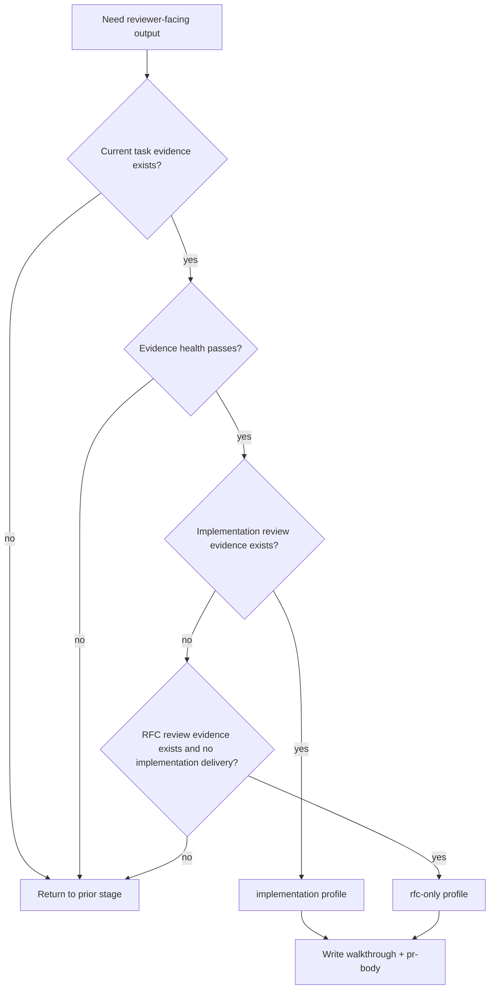

# report-walkthrough

## Overview

`report-walkthrough` 是 Legion 收口链里的 reviewer-facing evidence translator。它只把当前 task 已有、有效、通过前置阶段的证据整理成 reviewer 易扫读的交付说明；它不补设计、不补验证、不替代 `review-change` / `review-rfc`，也不替代 `legion-wiki` 或 PR lifecycle。

它还是阶段证据面向人类注意力的最终聚合器：复用 `review-rfc`、`verify-change`、`review-change` 已写入证据文件的 `会话注意力摘要` 与 claim 状态表，直接呈现当前唯一人类动作、未解决认知状态、领域 verifier 来源、证据独立性和残余不确定性。reviewer 应能先读 walkthrough 完成判断，只在需要审计原始依据时再打开证据文件。

默认输出是 HTML-first：`docs/report-walkthrough.html` 是主 reviewer artifact，`docs/report-walkthrough.md` 是 compact source / fallback，`docs/pr-body.md` 是 PR 创建或更新输入。PR-backed walkthrough 的 HTML artifact 完成后，默认交给 `pr-html-render` 形成 rendered preview path，或记录显式 render bypass / blocker。

## 输出语言与文档产物

- 默认用中文回答 walkthrough 范围、证据健康、profile、render handoff 和 PR body 交接。
- `docs/report-walkthrough.html`、`docs/report-walkthrough.md`、`docs/pr-body.md` 等文档产物默认使用中文正文。
- HTML 标签/属性、CSS、路径、命令、证据链接、GitHub/PR 字段、错误原文和模板标识保持原文，不因中文化破坏可渲染性或 PR lifecycle 语义。

## Hard Gate

- 必须已有当前 task 的实现产物或设计产物。
- 必须已有与当前 walkthrough profile 对应的前置证据。
- 前置证据必须是当前有效证据：属于当前 task、对应当前交付状态、结论不是 FAIL / blocked / stale。
- 交付摘要必须引用已有证据，而不是重新发明结论。
- 所依赖的 `review-rfc`、`verify-change`、`review-change` 证据必须包含符合 `REF_HUMAN_ATTENTION.md` 的 `## 会话注意力摘要`；缺失摘要不得由 walkthrough 代写。
- 实现交付必须从当前 `test-report.md` 与 `review-change.md` 读取 claim 状态；存在显式登记的关键 claim 时，必须能追溯到 `REF_COGNITIVE_VERIFICATION.md` 定义的状态记录。
- HTML walkthrough 必须是 self-contained single file，不依赖外部 CDN、字体、脚本或图片。
- `report-walkthrough` 只生成 HTML artifact，不发布 preview、不写 CI workflow、不创建 PR comment；这些属于 `pr-html-render` 的后续渲染职责。
- `pr-body.md` 只是 PR 创建/更新的输入材料，不代表 PR 已创建、checks 已过、review 已处理、PR 已 merged 或 lifecycle 已完成。

## When to Use

- 需要 `report-walkthrough.md`
- 需要 `report-walkthrough.html`
- 需要 `pr-body.md`
- 需要在 implementation 和 rfc-only 两种 reviewer 输出视角之间切换

不要用在：

- 证据还没齐的时候
- 需要补测试、补设计、补 review 的时候
- 需要完成 wiki writeback 或 PR lifecycle 的时候

## Walkthrough Profiles

这里的 profile 只是 reviewer 文档输出视角，不是 `legion-workflow` 的 execution mode，也不能新增第四种流程模式。

| Profile | 使用条件 | 不要误判为 |
|---|---|---|
| `implementation` | 已有实现结果、验证证据与 `review-change` | 不是只有 production code 变化才算；docs/config/test/script-only 实现交付也可以是 implementation |
| `rfc-only` | 本次只交付设计产物，已有 RFC 与 RFC review | 不是“没有 production code 改动”的默认兜底 |

## Decision Flow


```mermaid
flowchart TD
    A[Need reviewer-facing output] --> B{Current task evidence exists?}
    B -- no --> R[Return to prior stage]
    B -- yes --> C{Evidence health passes?}
    C -- no --> R
    C -- yes --> D{Implementation review evidence exists?}
    D -- yes --> I[implementation profile]
    D -- no --> E{RFC review evidence exists and no implementation delivery?}
    E -- yes --> F[rfc-only profile]
    E -- no --> R
    I --> W[Write walkthrough + pr-body]
    F --> W
```

## Entry Evidence Matrix

| Profile | Required evidence | Conditional evidence |
|---|---|---|
| `implementation` | `plan.md`；实现交接或实际变更文件；`docs/test-report.md`；`docs/review-change.md`；现有阶段注意力摘要与 claim 状态 | 如存在设计门：`docs/rfc.md` 与 `docs/review-rfc.md` |
| `rfc-only` | `plan.md`；`docs/rfc.md`；`docs/review-rfc.md`；RFC 审查的会话注意力摘要 | PR body 必须说明 merge 只代表设计批准，不代表实现完成；若已有设计级 claim 记录则一并聚合 |

## Evidence Health Check

Before writing reviewer-facing output, check every evidence file you rely on:

- It belongs to the current task root, not another task.
- It corresponds to the current delivery state or current diff, not an old attempt.
- Review evidence is PASS or PASS with non-blocking suggestions; FAIL / blocked evidence stops this stage.
- Verification evidence is not skipped-only and does not record unresolved implementation gaps.
- Every completion claim in the walkthrough has a cited evidence source.
- 各阶段摘要的阶段结论、注意力等级、人类动作与 claim 状态映射相互一致；walkthrough 不负责修正冲突。
- 按 `REF_HUMAN_ATTENTION.md` 的优先级、门禁与 lifecycle 规则处理所有仍有效的阶段注意力摘要；不得临场降低等级或绕过停止点。
- 非阻塞 `INCONCLUSIVE`、`DEFERRED`、`RECOMMENDATION` 可以被如实聚合；若其 `blocking-policy`、核心验收关系或上游阶段结论不允许继续，则不得包装为可交付状态。
- If evidence is stale, ambiguous, missing, or contradictory, do not smooth it over; return to the stage that should regenerate that evidence.

## Exit Evidence

- `docs/report-walkthrough.html`：主 reviewer-facing artifact
- `docs/report-walkthrough.md`
- `docs/pr-body.md`
- explicit profile note: `implementation` or `rfc-only`
- render handoff note for PR-backed tasks: rendered preview URL, artifact/internal-host fallback, or explicit render bypass / blocker for `pr-html-render`

## Communication Pass

Before writing the HTML artifact, do a clean-doc style selection pass:

- Reader: name the reviewer, maintainer, technical lead, or decision maker.
- Situation: state what they need to decide or inspect now.
- Main path: put conclusion, profile, scope, evidence, verification, risk, and final state before secondary history.
- Evidence selection: include only details that change approval, risk awareness, or next action.
- Certainty levels: separate facts, review results, assumptions, risks, limits, and next steps.
- 注意力摘要：先给出聚合后的最高注意力等级和 reviewer 当前唯一动作，再展开未解决 claim 与 verifier 依据。

If a detail is only background, link it from the evidence map or raw docs instead of expanding it in the HTML.

## HTML Walkthrough Requirements

`docs/report-walkthrough.html` is the primary walkthrough output. It must follow `references/TEMPLATE_REPORT_WALKTHROUGH_HTML.md` unless the task has a stronger project-specific design system.

Required qualities:

- Standalone semantic HTML: `<!doctype html>`, `lang`, viewport, meaningful `header` / `main` / `nav` / `section` / `table` structure.
- Product evidence interface: optimize for fast reviewer judgment, not decorative branding.
- OKLCH colors; do not use `#000` or `#fff`.
- No gradient text, side-stripe accent borders, decorative glassmorphism, hero-metric cliché, or identical card grids.
- No em dash characters in copy.
- Responsive layout and print-friendly CSS.
- Prominent final state or next stage near the top.
- 当前人类动作靠前：显示最高注意力等级、当前唯一动作，以及该动作完成前禁止越过的 lifecycle 边界。
- 注意力与 claim 聚合：页面必须内联呈现未解决 `INCONCLUSIVE`、`DEFERRED`、`RECOMMENDATION` 与领域 verifier 摘要，不能只给原始文件路径。
- Evidence map and delivery path must be visible, not buried.
- PR lifecycle disclaimer must remain explicit when relevant.
- For PR-backed tasks, include the render handoff state if known: `pr-html-render` pending, rendered URL, artifact-only/internal-host fallback, or explicit bypass/blocker.

## Report Walkthrough Structure

Use this minimum structure for both `docs/report-walkthrough.html` and the compact Markdown source/fallback. Write the body in the task's required document language; in this repository, task documents are normally Chinese.

```md
# 交付审阅指南

## 交付视角
implementation | rfc-only

## 审阅结论
- ...

## 人类注意力与当前动作
- 聚合注意力等级：{{aggregatedAttention}}
- 当前唯一人类动作：...
- 动作完成前的 lifecycle 边界：...

## 未解决的认知状态
| 主张 | 状态 | 对验收/风险的影响 | 负责人及状态专属字段 | 当前缓解 | 证据 |
|---|---|---|---|---|---|

## 领域验证摘要
| 主张 | Verifier 来源 | 方法 | 独立性及理由 | 置信度 | 通俗结论与未证明范围 | 残余不确定性 | 原始证据 |
|---|---|---|---|---|---|---|---|

## 范围
范围内：
范围外：

## 证据地图
| 主张 | 证据 | 状态 |
|---|---|---|

## 变更与决定
...

## 验证与审查状态
...

## 风险与限制
...

## 审阅清单
- [ ] ...

## 下一阶段
若处于 PR-backed lifecycle，先把 `docs/report-walkthrough.html` 交给 `pr-html-render` 渲染或记录显式 bypass/blocker；之后交给 `legion-wiki`。`pr-body.md` 仅作为 PR 创建/更新输入。
```

## 最终注意力聚合

生成 walkthrough 时按以下顺序整理，不执行新的验证：

1. 从当前 profile 的必需证据中读取每个已有的 `会话注意力摘要`，保留阶段、阶段结论、注意力等级、人类动作、自动下一步与证据路径。
2. 按 `REF_HUMAN_ATTENTION.md` 的优先级取仍有效摘要的最高注意力等级，并原样遵守其投影与 lifecycle 规则。只聚合上游已经给出的判断，不自行重算 claim 到 attention 的映射，也不把多个 Agent 的数量当作置信度。
3. 将最高等级对应的未完成动作压缩成一个“当前唯一人类动作”。动作措辞与停止点必须来自 `REF_HUMAN_ATTENTION.md` 和上游摘要，不在 walkthrough 内重新定义注意力等级语义。
4. 从当前 claim 状态表列出所有仍为 `INCONCLUSIVE`、`DEFERRED`、`RECOMMENDATION` 的关键 claim。每行至少内联 `claim-id`、主张、对验收或风险的影响、当前 owner 或 decision owner、当前缓解与直接证据入口。
5. `DEFERRED` 还要内联触发条件、届时方法与停止/回滚条件；`RECOMMENDATION` 还要内联待选项、推荐方案、价值取舍与决定是否已经完成。不要让 reviewer 为理解这些字段重新遍历原始文件。
6. 对已使用领域 verifier 的 claim，内联 verifier 精确来源、实际方法、证据独立性等级及理由、置信度、残余不确定性、失效条件与原始证据入口。这里只转录已经由 `verify-change` 产出并经 `review-change` 审查的结果，不重开 locator、不重算摘要、不重跑工具。
7. 已解决的 `PASS` / `FAIL` claim 只给总数和会改变批准判断的少量关键项；完整列表保留在证据地图。没有显式登记的关键 claim 时，明确写“当前证据未登记需要单独聚合的关键 claim”，不得虚构空表结论。
8. 若阶段摘要、claim 状态、领域 verifier 结果或人类动作相互矛盾，停止并退回产生冲突证据的前置阶段，不能由 walkthrough 选择一个更乐观的版本。

最终页面和 PR body 必须让 reviewer 不打开原始文件也能回答：现在结论是什么、我现在唯一要做什么、哪些结论仍不确定或延后、专业证据来自哪里、它独立到什么程度、还有什么没有证明。原始路径用于深入审计，不是理解结论的必经路径。

## PR Body Templates

- HTML walkthrough template: use `references/TEMPLATE_REPORT_WALKTHROUGH_HTML.md`.
- rendered PR preview handoff: use `pr-html-render` after the HTML artifact exists.
- implementation profile: use `references/TEMPLATE_PR_BODY_IMPLEMENTATION.md`.
- rfc-only profile: use `references/TEMPLATE_PR_BODY_RFC_ONLY.md`.

Both templates are inputs to PR creation or update only. They do not prove that the PR was opened, checks passed, review completed, auto-merge enabled, worktree cleaned, or the main workspace refreshed.

两个 PR body 模板都必须复用 walkthrough 的最终注意力聚合，至少包含聚合注意力等级、当前唯一人类动作、未解决认知状态、领域 verifier 摘要和 lifecycle 边界。PR body 不得只写“详见报告”而隐藏会改变批准判断的内容。

## Must Not

- 不要在这里补跑测试
- 不要在这里重新写设计方案
- 不要把未验证 claim 写成既成事实
- 不要在这里重跑命令、重开 verifier locator、重算摘要或重新判定 claim 状态
- 不要重新推导 attention 等级或降低上游记录的最高等级
- 不要为聚合结果新增 attention 文档、台账、skill 或执行阶段
- 不要让 reviewer 必须打开 `test-report.md`、`review-change.md` 或原始输出，才能知道当前动作和关键不确定性
- 不要把 FAIL / blocked / stale evidence 包装成 ready-to-merge 摘要
- 不要因为没有 production code 变化就自动选择 rfc-only profile
- 不要只生成 Markdown 而跳过 HTML walkthrough，除非明确记录 HTML artifact 被用户或环境显式 bypass
- 不要把 HTML 写成依赖外部资源的网页应用
- 不要在 walkthrough 阶段补 preview workflow、发布 rendered URL 或创建 PR comment；交给 `pr-html-render`
- 不要把 `pr-body.md` 写成 PR lifecycle 已完成的证据

## Return Conditions

- implementation profile 缺 `docs/test-report.md`：退回 `verify-change`
- implementation profile 缺 `docs/review-change.md`：退回 `review-change`
- `docs/review-change.md` 为 FAIL / blocked：退回 `engineer` 或对应修复阶段
- design gate exists 但缺 `docs/rfc.md` / `docs/review-rfc.md`：退回 `spec-rfc` / `review-rfc`
- rfc-only profile 缺 `docs/rfc.md` / `docs/review-rfc.md`：退回 `review-rfc`
- `docs/review-rfc.md` 为 FAIL / blocked：退回 `spec-rfc`
- evidence stale、非当前 task、或与当前 diff 不一致：退回生成该证据的前置阶段
- 必需阶段证据缺 `会话注意力摘要`，或摘要与 claim 状态冲突：退回产生该证据的 `review-rfc`、`verify-change` 或 `review-change`
- 聚合注意力触发 `REF_HUMAN_ATTENTION.md` 定义的停止点：严格按该协议退回、等待或限制 PR lifecycle，不在 walkthrough 中自行放宽
- 领域 verifier 的来源、独立性或残余不确定性在上游证据中缺失：退回 `verify-change` / `review-change`，不得在 walkthrough 中补写
- HTML walkthrough 缺少 evidence map、delivery path、final state / next stage、或 PR lifecycle disclaimer：补齐 walkthrough artifact 后再继续
- PR-backed walkthrough 缺 rendered preview path 且没有 explicit render bypass / blocker：交给 `pr-html-render`，不要在本 skill 中补发布逻辑
- walkthrough 完成后：交给 `legion-wiki`

## Common Rationalizations

| Excuse | Reality |
|---|---|
| "边写 walkthrough 边把缺的 testing 补了" | walkthrough 只重组证据，不补证据。 |
| "design-only 也照 implementation 模板写就行" | 两种 profile 的输入证据不同，必须显式区分。 |
| "先写结论，后面再找引用" | reviewer-facing 文档必须从已有 evidence 出发。 |
| "没有 production code 变化，所以就是 rfc-only" | profile 取决于阶段链和证据，不取决于 production code 是否变化。 |
| "PR body 写好了，所以 PR 交付完成" | PR body 只是 lifecycle 输入；完成仍由 `git-worktree-pr` 的 PR 终态、checks/review、cleanup 和 refresh 决定。 |
| "Markdown 已经够清楚，不需要 HTML" | 默认是 HTML-first；Markdown 是 source / fallback，不是主 reviewer artifact。 |
| "HTML 好看就行" | HTML 必须先服务 reviewer 判断，且每个完成性 claim 都要能回到 evidence。 |
| "HTML 文件已经生成，reviewer 自己下载就行" | PR-backed walkthrough 默认需要 `pr-html-render` 形成 rendered preview path，除非有显式 bypass 或 blocker。 |
| "原始报告里都有，PR body 放个路径就够了" | reviewer 的当前动作、未解决状态与专业证据限制必须直接呈现，路径只用于深入审计。 |
| "walkthrough 再核对一次 verifier 更稳妥" | verifier 的执行与复核属于 `verify-change` / `review-change`；walkthrough 只聚合已审查证据。 |
| "几个阶段都是 PASS，可以忽略 review attention" | 阶段 PASS 不会清除未解决的 `review`；merge 前人工复核边界必须保留。 |

## Red Flags

- 没标明当前 profile
- implementation profile 缺 `test-report.md`
- implementation profile 缺 `review-change.md`
- rfc-only profile 缺 `review-rfc.md`
- evidence health check 没做或结果含糊
- 没有聚合最高注意力等级与当前唯一人类动作
- 未解决 `INCONCLUSIVE`、`DEFERRED`、`RECOMMENDATION` 只藏在原始文件里
- 领域 verifier 只写名称，没有来源、独立性和残余不确定性
- walkthrough 对 claim 或 verifier 进行了新的验证判断
- 缺 `docs/report-walkthrough.html`，但没有显式 bypass 记录
- HTML 依赖外部资源，或违反 OKLCH / no gradient text / no side-stripe / no em dash 等质量门
- 在 walkthrough 里发明未被验证的结论
- 把 blocked handoff 写成 ready-to-merge delivery
- PR-backed HTML artifact 没有 rendered preview path，也没有 explicit render bypass / blocker

## References

- HTML walkthrough 模板：`references/TEMPLATE_REPORT_WALKTHROUGH_HTML.md`
- 会话注意力协议：`../legion-workflow/references/REF_HUMAN_ATTENTION.md`
- 认知验证与领域 verifier 协议：`../verify-change/references/REF_COGNITIVE_VERIFICATION.md`
- Rendered PR preview：`pr-html-render`
- Implementation PR 模板：`references/TEMPLATE_PR_BODY_IMPLEMENTATION.md`
- RFC-only PR 模板：`references/TEMPLATE_PR_BODY_RFC_ONLY.md`
