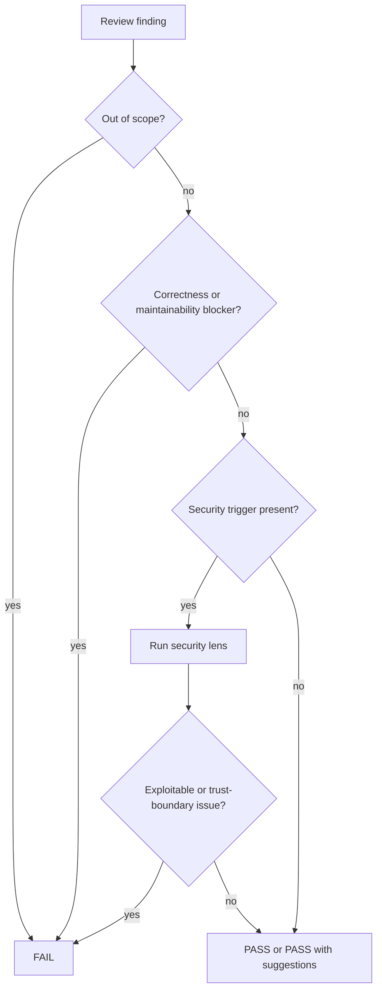

# review-change

## Overview

这是统一的只读审查阶段。它同时负责 correctness、maintainability、scope compliance，以及在命中安全触发条件时展开 security review；目标是判断“现在能不能过”，而不是替作者继续设计或实现。

## Hard Gate

- 必须先有实现结果与验证证据，再进入本阶段。
- 这是只读审查；不在这里修代码。
- 任何阻塞项都必须给出路径、原因、影响和最小修复方向。

## When to Use

- 需要判断变更是否 ready
- 需要统一输出 reviewer-facing 审查结论
- 需要检查 scope 越界或安全敏感变更

不要用在：

- 还没有 `test-report.md` 的时候
- 需要挑战设计假设时；那属于 `review-rfc`
- 需要生成 reviewer 摘要时；那属于 `report-walkthrough`

## Decision Flow

## Security Triggers

- auth / permission / identity / session / token
- trust boundary or protocol boundary changes
- secrets / signing / crypto / webhook verification
- user-controlled input entering privileged paths
- data exposure / privacy / tenant isolation

## Required Output

- `docs/review-change.md`
- PASS / FAIL
- blocking findings first
- optional non-blocking suggestions
- explicit note if security lens was applied

## Must Not

- 不要把 code review 写成实现计划
- 不要把抽象担忧写成 blocking
- 不要把一般代码风格问题伪装成安全问题
- 不要跳过 scope 检查

## Return Conditions

- implementation blocking：退回 `engineer`
- verification evidence 不足：退回 `verify-change`
- 设计与实现根本不一致：退回 `spec-rfc` / `review-rfc`

## Common Rationalizations

| Excuse | Reality |
|---|---|
| "看起来能跑，就别卡了" | 只读 review 的职责就是决定现在能不能过。 |
| "这个风险像安全，但先留到以后" | 命中 security trigger 就必须展开安全视角。 |
| "只是 scope 外顺手改一点" | scope 外改动本身就是阻塞。 |
| "给点泛泛建议就够了" | Blocking 必须有定位、原因、影响、修复方向。 |

## Red Flags

- 没读 `plan.md` 和 `test-report.md`
- 只有结论，没有证据
- 发现越界却没有标 FAIL
- 命中安全触发条件却没有展开安全判断
