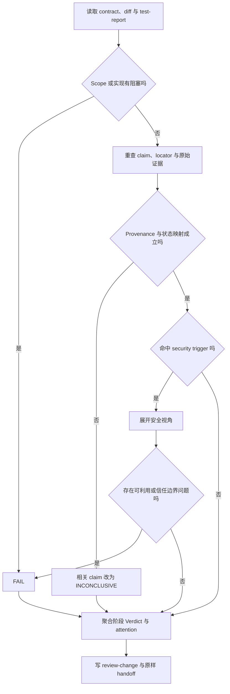

# review-change

## Overview

这是统一的只读审查阶段。它同时负责 correctness、maintainability、scope compliance、验证证据充分性，以及在命中安全触发条件时展开 security review；目标是判断“现在能不能过”，而不是替作者继续设计、实现或补造证据。

对领域验证，审查者必须从 locator、内容摘要、执行记录和原始输出来重查 provenance。报告中自称“已加载 verifier”或“专家已确认”没有证明力。

## 输出语言与文档产物

- 默认用中文回答审查结论、blocking findings、non-blocking suggestions、专业证据限制和安全视角说明。
- `docs/review-change.md` 等审查文档产物默认使用中文；精确的 `PASS / FAIL` 标记保留英文以兼容阶段协议。
- 代码、diff 片段、命令、错误原文、security/correctness 术语和外部平台字段保持原文，必要时用中文解释影响。

## Hard Gate

- 必须先有实现结果与 `docs/test-report.md`，再进入本阶段。
- 必须完整读取 `../verify-change/references/REF_COGNITIVE_VERIFICATION.md` 与 `../legion-workflow/references/REF_HUMAN_ATTENTION.md`，并按其单一真源重查状态和摘要。
- 这是只读审查；不在这里修代码、运行会改变产品状态的操作或补写验证者缺失的 provenance。
- 任何阻塞项都必须给出路径、原因、影响和最小修复方向。

## When to Use

- 需要判断变更是否 ready
- 需要统一输出 reviewer-facing 审查结论
- 需要检查 scope 越界或安全敏感变更
- 需要重查 claim 状态、领域 verifier provenance 或 authority evidence
- 需要输出会话注意力摘要，让审计意见在 chat session 可见

不要用在：

- 还没有 `test-report.md` 的时候
- 需要挑战设计假设时；那属于 `review-rfc`
- 需要生成最终 reviewer walkthrough 时；那属于 `report-walkthrough`

## Decision Flow

```mermaid
flowchart TD
    A[读取 contract、diff 与 test-report] --> B{Scope 或实现有阻塞吗}
    B -- 是 --> C[FAIL]
    B -- 否 --> D[重查 claim、locator 与原始证据]
    D --> E{Provenance 与状态映射成立吗}
    E -- 否 --> F[相关 claim 改为 INCONCLUSIVE]
    E -- 是 --> G{命中 security trigger 吗}
    G -- 是 --> H[展开安全视角]
    G -- 否 --> I[聚合阶段 Verdict 与 attention]
    H --> J{存在可利用或信任边界问题吗}
    J -- 是 --> C
    J -- 否 --> I
    F --> I
    C --> I
    I --> K[写 review-change 与原样 handoff]
```

## Security Triggers

- auth / permission / identity / session / token
- trust boundary or protocol boundary changes
- secrets / signing / crypto / webhook verification
- user-controlled input entering privileged paths
- data exposure / privacy / tenant isolation

## 必需输入

- `plan.md`
- 设计真源及 `docs/review-rfc.md`（若存在）
- 实际 changed files / diff
- `docs/test-report.md`
- test report 引用的 verifier 资源、执行记录与原始输出 locator
- authority evidence locator（若存在）

## 审查流程

1. 检查实际 diff 是否满足 contract、是否越过 scope，以及实现是否存在 correctness、maintainability 或安全阻塞。
2. 对照认知验证 reference，确认 test report 的关键 claim 具备预注册字段，三轴、领域、能力、方法、错误代价和阻塞策略没有被 verifier 临场改写。
3. 逐个重新打开 verifier 精确 locator 和实际读取资源清单；核对资源存在性，并重算所有可重算的 SHA-256 或版本标识。不能读取、摘要不一致或资源清单缺失时，相关 claim 必须为 `INCONCLUSIVE`。
4. 检查实际命令或工具调用、关键参数、exit code / 结果标识与 repo 内原始输出 locator；确认敏感信息已处理，且每份原始输出都能逐项映射到对应 `claim-id` 和方法步骤。
5. 核对候选 verifier 是否真实覆盖预注册的 `domain-id`、`required-capability` 与 `required-method`，以及规定的方法是否真的执行。文字自述、角色名称或多个 Agent 的共识不能补足缺失证据。
6. 检查 verifier 是否记录独立性理由、主动反例、置信度、残余不确定性、失效条件与非领域专家解释。多个 verifier 分歧时必须保持 `INCONCLUSIVE`，不得多数表决。
7. 对 authority evidence 重新核对主体、资质来源、范围与 `claim-id`、有效期、locator、完整性/真实性/签名校验和限制条件。缺失、过期、越界或校验失败都导出 `INCONCLUSIVE`；全部成立的权威证据可以与其他证据共同支持 `PASS`。
8. 检查 `DEFERRED` 是否有真实触发条件、owner、届时方法、当前缓解与成功/失败更新路径；检查 `RECOMMENDATION` 是否把事实与偏好分开并记录选项、取舍和 decision owner。
9. 按认知验证 reference 重新聚合 claim 状态、独立的阶段级 `## Verdict` 与最高 attention。审查结论不能因为 test report 写了 PASS 就跳过重算。
10. 在 `docs/review-change.md` 内嵌 `## 会话注意力摘要`，关键发现最多三项。最终 handoff 原样返回该小节，由 orchestrator 在派生下一阶段前投影给用户。

## 来源记录（provenance）负例硬规则

只要 test report 写有“已真实加载 verifier”，但缺少以下任一项，相关 claim 就只能是 `INCONCLUSIVE`：

- verifier locator；
- 版本或可重算摘要；
- 实际读取的 `SKILL.md` 与必要 reference 清单；
- 命令/工具执行记录及结果；
- repo 内原始输出 locator；
- 原始输出、方法步骤与 `claim-id` 的映射。

审查者不得替验证者补齐这些字段后判 PASS；应退回 `verify-change` 重新形成证据。

## Required Output

- `docs/review-change.md`
- blocking findings 优先，每项包含定位、原因、影响和最小修复方向
- optional non-blocking suggestions
- scope compliance 结论
- verification evidence 充分性结论
- verifier provenance 重查结果，包括 locator、摘要、执行记录、原始输出和 claim 映射
- authority、`DEFERRED`、`RECOMMENDATION` 的适用审查结果
- explicit note if security lens was applied
- 独立、精确的 `## Verdict`，其下一有效内容只能是 `PASS` 或 `FAIL`
- 内嵌的 `## 会话注意力摘要`
- 最终 handoff 原样返回注意力摘要，不得只给文件路径

claim 状态、阶段 Verdict 映射、provenance、authority 正负路径及特殊主张规则只以认知验证 reference 为准；四级 attention、三项上限与 lifecycle 门禁只以人类注意力 reference 为准。

## Must Not

- 不要把 code review 写成实现计划
- 不要在只读审查里修代码或补造验证证据
- 不要把抽象担忧写成 blocking
- 不要把一般代码风格问题伪装成安全问题
- 不要跳过 scope 检查
- 不要相信“已加载 verifier”的文字声明而不重开 locator、重算摘要、核对执行与原始输出
- 不要让 authority 身份覆盖证据适用范围外的 claim
- 不要把 `INCONCLUSIVE`、`DEFERRED` 或 `RECOMMENDATION` 误当作阶段 PASS
- 不要为了会话简短而把 FAIL、风险升级或专业证据缺口只留在文件中

## Return Conditions

- implementation blocking：阶段 `FAIL`，退回 `engineer`
- verification evidence 或 provenance 不足：相关 claim 为 `INCONCLUSIVE`，阶段与 attention 按预注册策略聚合，退回 `verify-change` 或等待人类决定
- 设计与实现根本不一致或 claim 分类错误：退回 `spec-rfc -> review-rfc`
- 需要人类选择、接受风险、补权限或外部权威：attention 为 `decide`，停止受影响路径
- 非阻塞专业证据限制或延后事项：可按 contract 继续准备 walkthrough / PR 材料，但 attention 至少为 `review`，不得越过注意力协议规定的 merge 门
- 审查通过：交给 `legion-workflow` 继续后续交付阶段

## Common Rationalizations

| 借口 | 事实 |
|---|---|
| “看起来能跑，就别卡了” | 只读 review 的职责就是决定现有证据能否支持当前 claim。 |
| “报告写了 SHA，没必要重算” | 可重算摘要必须重算，否则 provenance 只是自述。 |
| “这个 verifier 名称很专业” | 名称不能证明它覆盖预注册领域、能力与方法。 |
| “权威是真的，范围应该也够” | 主体真实不等于证据覆盖当前 claim。 |
| “这个风险像安全，但先留到以后” | 命中 security trigger 就必须展开安全视角。 |
| “只是 scope 外顺手改一点” | Scope 外改动本身就是阻塞。 |

## Red Flags

- 没读 `plan.md`、设计真源、`test-report.md` 和两个必需 reference
- 只有结论，没有从 locator 与原始输出重查证据
- verifier provenance 缺字段却仍判 claim PASS
- authority evidence 过期、越界或校验失败却仍参与 PASS
- `DEFERRED` 没有 owner / 触发条件 / 届时方法
- 发现越界却没有标阶段 FAIL
- 命中安全触发条件却没有展开安全判断
- `## Verdict` 被 claim 状态表替代
- handoff 只写“详见 review-change.md”

## References

- 认知验证与领域 verifier：`../verify-change/references/REF_COGNITIVE_VERIFICATION.md`
- 人类注意力交接：`../legion-workflow/references/REF_HUMAN_ATTENTION.md`
- 最终汇总：`report-walkthrough`
