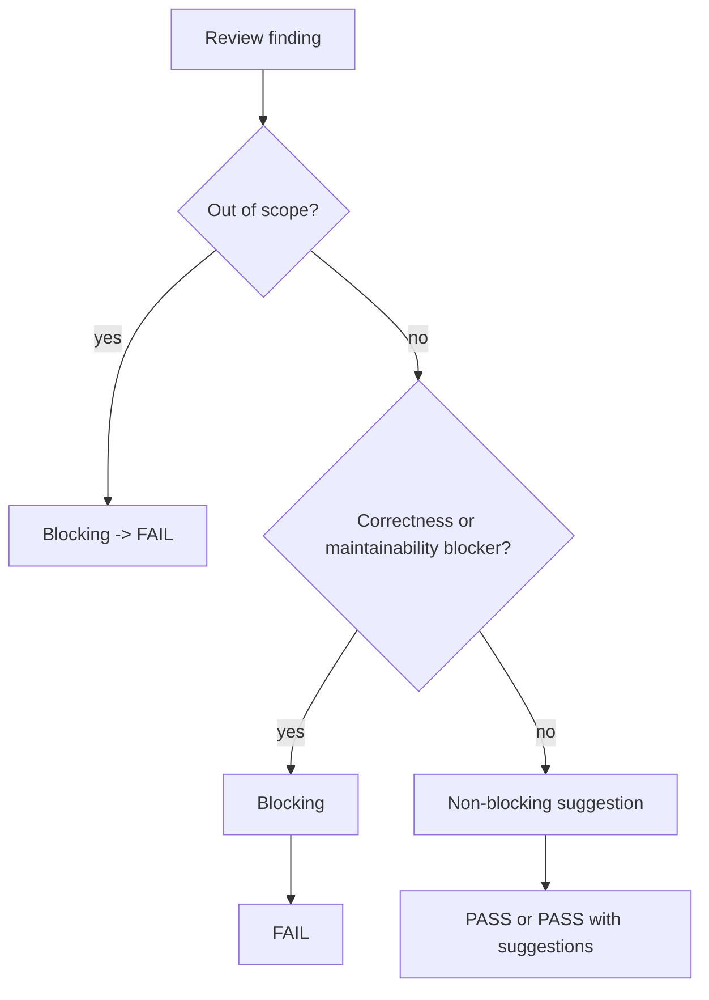

# review-code

## Overview

这是只读 review。目标是判断“这份实现现在能不能过”，而不是替作者重写方案。

## When to Use

- 已有实现变更，需要 correctness / maintainability review
- 需要输出 `review-code.md`
- 需要检查是否越过既定 scope

## Decision Flow

## Quick Reference

- 必须给 PASS / FAIL
- Blocking 要带路径、定位、原因、修复方向
- scope 外改动直接 FAIL

## Common Mistakes

- 只给泛泛建议，不指出阻塞点
- 把 code review 写成实现计划
