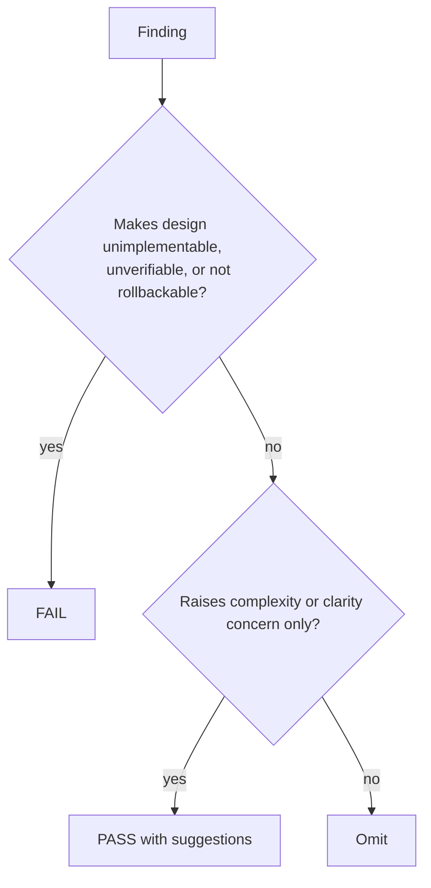

# review-rfc

## Overview

`review-rfc` 的职责是决定设计现在能不能过门，而不是把 RFC 重写一遍。

## Hard Gate

- 必须先有 RFC 或 design source
- 输出必须是 PASS / FAIL
- blocking finding 必须说明为什么它会让实现不可行、不可验证、或不可回滚

## When to Use

- 实现前的设计对抗审查
- 需要确认 RFC 是否足够小、足够清楚、可验证、可回滚

## Decision Flow

## Review Lenses

- unnecessary complexity
- weak assumptions
- missing rollback
- weak verification
- scope ambiguity
- missing alternatives for meaningful trade-offs

## Must Not

- 不要给抽象哲学意见
- 不要替作者重写整份 RFC
- 不要把可以后续优化的小建议写成 blocking

## Return Conditions

- FAIL: 退回 `spec-rfc`
- PASS: 交回 `legion-workflow` 进入实现

## Common Rationalizations

| Excuse | Reality |
|---|---|
| "大方向没问题，细节实现时再补" | verification / rollback / boundary gaps 会直接阻塞实现。 |
| "我已经懂作者想法，不必写 FAIL" | review-rfc 的职责是判断设计是否过门，不是心领神会。 |
| "把 blocking 说成 suggestion 更温和" | 会让未过门的设计混进实现阶段。 |

## Red Flags

- 没解释为什么某项是 blocking
- 明显缺 rollback/verification 仍给 PASS
- 用重写 RFC 代替审查结论
