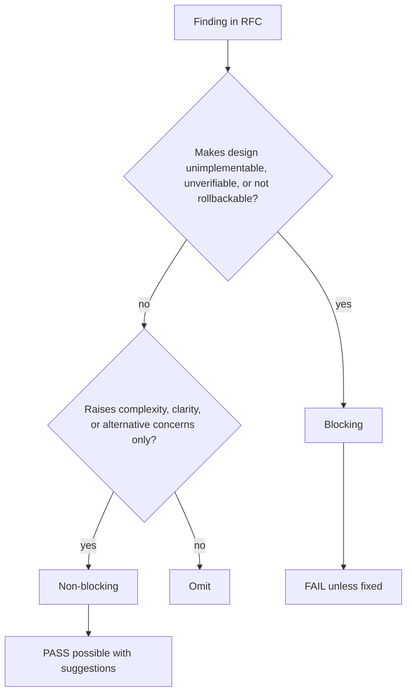

# review-rfc

## Overview

用奥卡姆剃刀审查 RFC，重点找“为什么这不是更小、更清楚、更可回滚的方案”。

## When to Use

- 已有 RFC，需要在实现前做设计对抗审查
- 需要确认 Blocking / Non-blocking
- 需要检查 heavy RFC 的额外必备章节

## Decision Flow

## Quick Reference

- 先质疑必要性，再质疑边界、复杂度、替代方案
- 每个 Blocking 都要给最小化复杂度的修复方向
- heavy 额外看 Executive Summary、Alternatives、Rollback、Observability、Milestones

## Common Mistakes

- 只提抽象意见，不给可执行修复方向
- 把 review 写成 RFC 重写稿
