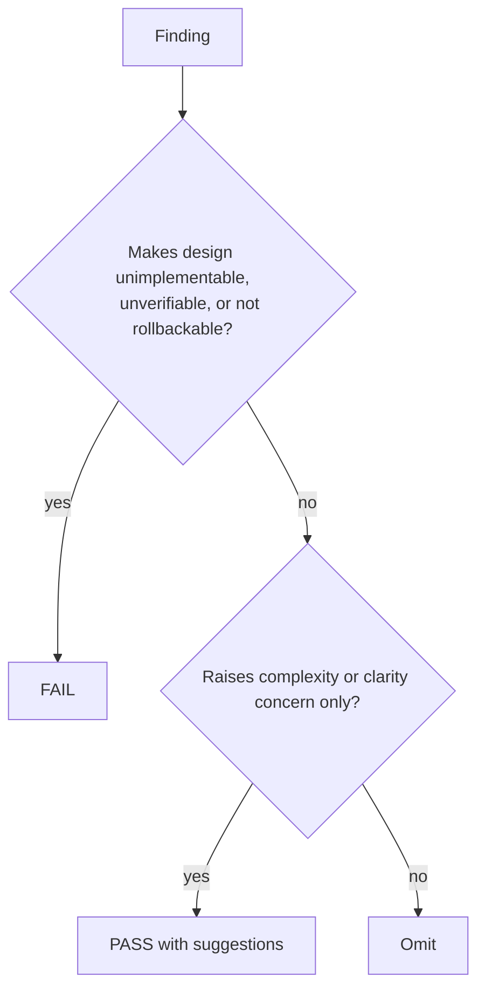

# review-rfc

## Overview

`review-rfc` 的职责是决定设计现在能不能过门，而不是把 RFC 重写一遍。完整结论写入 `docs/review-rfc.md`，同时形成面向人类的低噪音会话注意力摘要。

## 输出语言与文档产物

- 默认用中文回答设计审查结论、blocking findings、建议和实现准入判断。
- `docs/review-rfc.md` 等审查文档产物默认使用中文；PASS / FAIL 标记可以保留英文以保持阶段协议清晰。
- RFC 标题、路径、技术术语、命令、错误原文和外部接口名称保持原文，必要时用中文解释风险。

## Hard Gate

- 必须先有 RFC 或 design source
- 输出必须是 PASS / FAIL
- blocking finding 必须说明为什么它会让实现不可行、不可验证、或不可回滚
- 必须完整读取 `../legion-workflow/references/REF_HUMAN_ATTENTION.md` 与 `../verify-change/references/REF_COGNITIVE_VERIFICATION.md`
- `docs/review-rfc.md` 必须保留独立的精确 `## Verdict` 区块，其下一有效内容只能是 `PASS` 或 `FAIL`
- `docs/review-rfc.md` 必须内嵌 `## 会话注意力摘要`，最终 handoff 必须原样返回该小节

## When to Use

- 实现前的设计对抗审查
- 需要确认 RFC 是否足够小、足够清楚、可验证、可回滚

## Decision Flow

```mermaid
flowchart TD
    A[Finding] --> B{Makes design unimplementable,
    unverifiable, or not rollbackable?}
    B -- yes --> C[FAIL]
    B -- no --> D{Raises complexity or clarity concern only?}
    D -- yes --> E[PASS with suggestions]
    D -- no --> F[Omit]
```

## Review Lenses

- unnecessary complexity
- weak assumptions
- missing rollback
- weak verification
- scope ambiguity
- missing alternatives for meaningful trade-offs
- 关键 claim 是否在 verifier 选择前完成认知验证真源要求的预注册，且与验收、风险和阻塞策略相连
- verifier 发现、真实加载、provenance 重查与 authority evidence 是否具有可执行的正负路径
- claim 状态到阶段 `Verdict`、attention 和 lifecycle 停止点的映射是否明确，是否把延后验证或判断性主张伪装成客观通过

## 输出与会话交接

1. 把 blocking findings、非阻塞建议、独立 `## Verdict` 与 `## 会话注意力摘要` 写入当前 task 的 `docs/review-rfc.md`。
2. 摘要字段、四级 attention、三项上限和 noise policy 只按 `REF_HUMAN_ATTENTION.md` 生成，不在本 skill 复制另一套 schema。
3. 摘要只写相对 RFC 的判断变化；完整论证留在审查文档。`FAIL`、风险升级、验收变化和专业证据缺口不得只留在文件里。
4. 最终 handoff 原样返回已落盘的 `## 会话注意力摘要`，并提醒 orchestrator 在派生下一阶段或执行普通回退前直接投影。
5. 阶段 sub-agent 不自行压缩、改写或隐藏 attention；投影和 lifecycle 门禁由 orchestrator 执行。

## Must Not

- 不要给抽象哲学意见
- 不要替作者重写整份 RFC
- 不要把可以后续优化的小建议写成 blocking

## Return Conditions

- FAIL：通常退回 `spec-rfc`；若摘要为 `decide`，先等待决定持久化，不能执行普通回退
- PASS：交回 `legion-workflow`；`none` / `skim` 可进入实现，`review` 只能在对应 merge 门前继续准备材料，`decide` 停止阶段转换

## Common Rationalizations

| Excuse | Reality |
|---|---|
| "大方向没问题，细节实现时再补" | verification / rollback / boundary gaps 会直接阻塞实现。 |
| "我已经懂作者想法，不必写 FAIL" | review-rfc 的职责是判断设计是否过门，不是心领神会。 |
| "把 blocking 说成 suggestion 更温和" | 会让未过门的设计混进实现阶段。 |

## Red Flags

- 没解释为什么某项是 blocking
- 明显缺 rollback/verification 仍给 PASS
- 用重写 RFC 代替审查结论
- 只返回审查文件路径，没有把会话注意力摘要原样交给 orchestrator
- 用阶段 `FAIL` 覆盖 `decide`，或把多个未解决 claim 的最高 attention 临场降级

## 参考

- 会话注意力摘要与 lifecycle 门禁：`../legion-workflow/references/REF_HUMAN_ATTENTION.md`
- 三轴验证、claim 状态与领域 verifier 协议：`../verify-change/references/REF_COGNITIVE_VERIFICATION.md`
