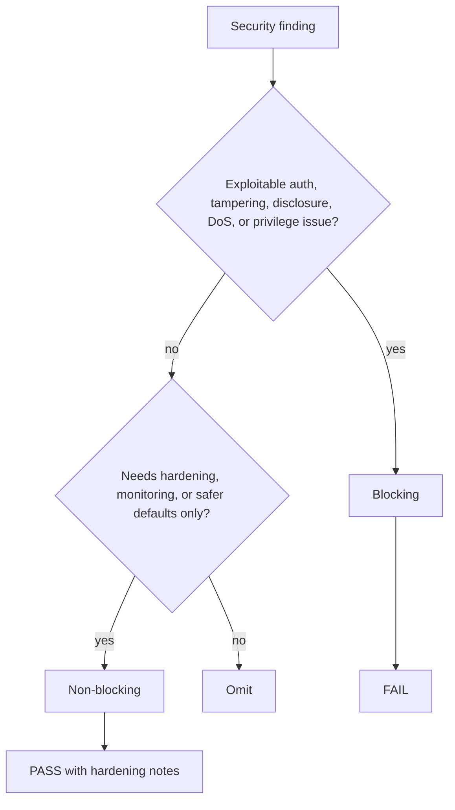

# review-security

## Overview

这是 STRIDE 导向的只读安全审查，重点找能被利用的边界、默认不安全行为和高代价缺口。

## When to Use

- 变更涉及 auth、permission、protocol、data handling、secret 或外部输入
- 需要输出 `review-security.md`
- 需要把安全阻塞项与加固项分开

## Decision Flow

## Quick Reference

- 用 STRIDE 覆盖 spoofing / tampering / repudiation / disclosure / DoS / privilege
- 额外看协议绕过、secure-by-default、依赖风险、硬编码凭证
- 必须给 PASS / FAIL 与可执行修复建议

## Common Mistakes

- 只列风险名词，不说明利用面与修复路径
- 把一般代码质量问题误写成安全阻塞
