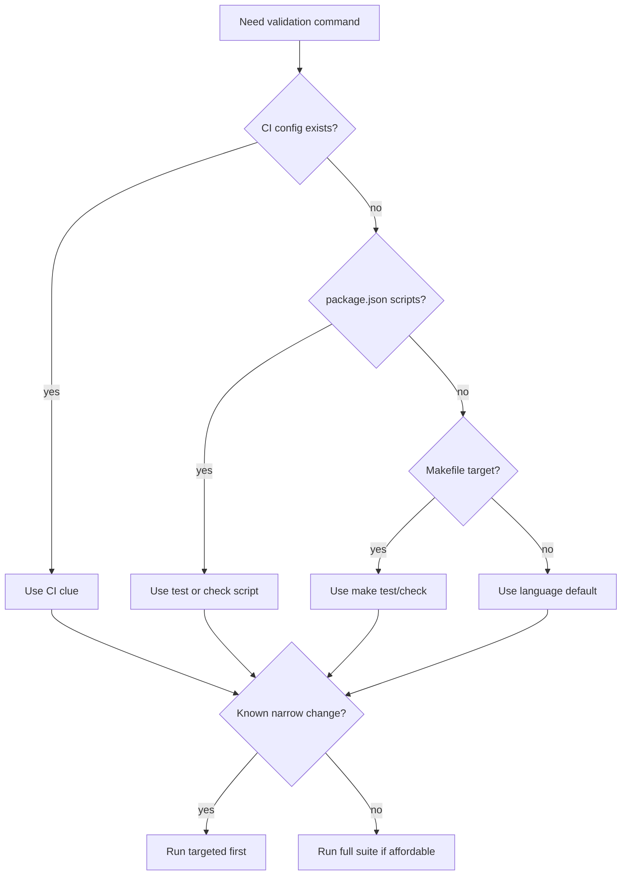

# run-tests

## Overview

目标是快速找到“最可能正确且代价最低”的验证命令，并把结果写成 reviewer 可读的测试报告。

## When to Use

- 需要生成 `test-report.md`
- 没有明确测试命令，需要按仓库线索推断
- 需要验证实现，但不应该顺手做大改代码

## Decision Flow

## Quick Reference

- 推断顺序：CI → package scripts → Makefile → 语言默认命令
- 优先 targeted；成本可接受时再全量
- 报告必须写命令、结果、失败项、选择原因

## Common Mistakes

- 因为不确定命令就停下来追问
- 在测试阶段顺手做大规模修复
