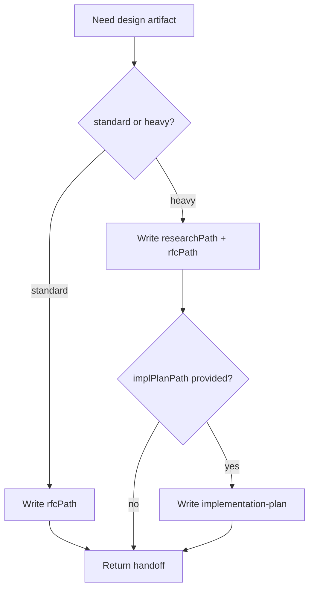

# spec-rfc

## Overview

只写设计文档，不写生产代码，也不改 `.legion` 三文件。RFC 应保持“可评审密度”，而不是实现手册全集。

## When to Use

- 任务需要标准或 heavy RFC
- 需要补 `research.md` 现状摸底
- 需要从 RFC 里抽 `implementation-plan.md`

不要用在审查 RFC 或实现代码；分别用 `review-rfc`、`engineer`。

## Decision Flow

## Quick Reference

- 先读 `plan.md`，再按需读现状证据
- 默认写 `rfcPath`
- heavy 额外写 `researchPath`
- 提供 `implPlanPath` 时抽取 milestones

## References

- RFC 档位与章节要求：读 [references/REF_RFC_PROFILES.md](./references/REF_RFC_PROFILES.md)
- Heavy RFC 模板：读 [references/TEMPLATE_RFC_HEAVY.md](./references/TEMPLATE_RFC_HEAVY.md)
- 现状摸底模板：读 [references/TEMPLATE_RESEARCH.md](./references/TEMPLATE_RESEARCH.md)
- 实施计划模板：读 [references/TEMPLATE_IMPLEMENTATION_PLAN.md](./references/TEMPLATE_IMPLEMENTATION_PLAN.md)
