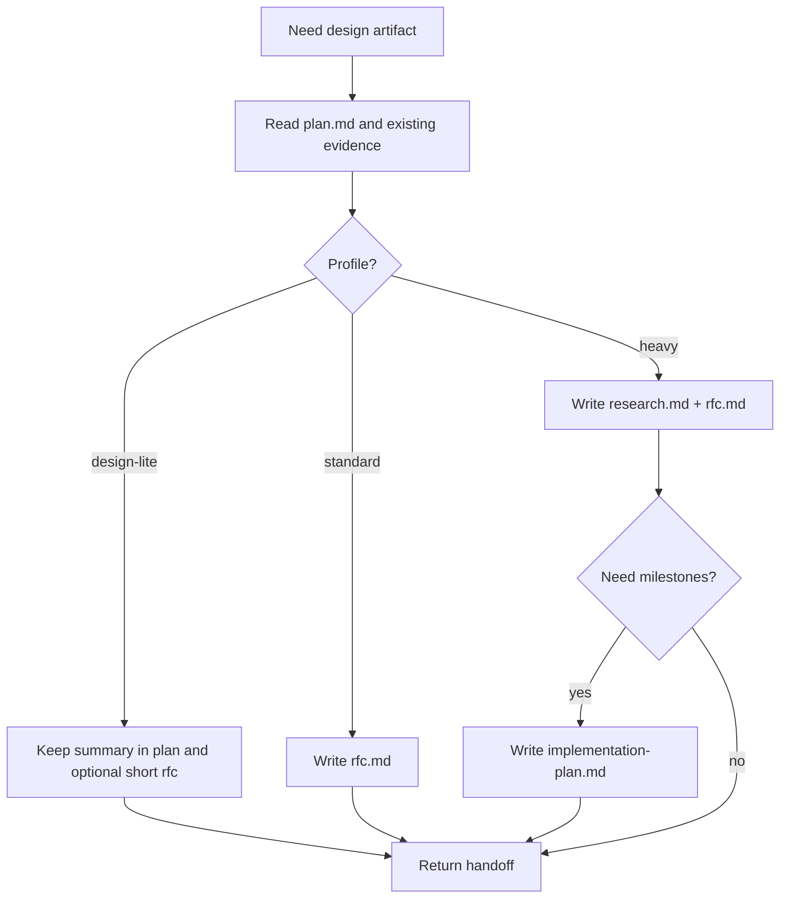

# spec-rfc

## Overview

`spec-rfc` 只负责设计产物。它不改 `.legion` 三文件，不写生产代码，也不替代 `review-rfc`。

## Hard Gate

- 进入前必须已有稳定 contract
- 需要的只是设计，不是实现
- 如果发现 contract 还在漂移，退回 `brainstorm`

## When to Use

- 存在 2 个以上真实设计选项
- 回滚路径、验证路径、或边界变化还不清楚
- 需要 `research.md` 摸底现状
- 需要从 RFC 抽取 `implementation-plan.md`

不要用在：

- 设计已经充分且只需实现时
- 需要对抗审查时；那属于 `review-rfc`

## Core Loop

## Required Output

- `docs/rfc.md`
- `docs/research.md` for heavy work
- optional `docs/implementation-plan.md`

## Must Not

- 不要把 RFC 写成实现手册全集
- 不要在这里修代码
- 不要把未确认的背景当事实写死

## Return Conditions

- contract 不稳定：退回 `brainstorm`
- 需要设计裁决：交给 `review-rfc`

## Common Rationalizations

| Excuse | Reality |
|---|---|
| "先按我脑子里的方案写，RFC 后补" | 需要 RFC 的任务本来就是因为不能直接写。 |
| "只有一个方案，不用写 alternatives" | 只要存在真实 trade-off，就必须显式比较。 |
| "rollback 之后再想" | 设计门的目的之一就是提前写清 rollback。 |

## Red Flags

- contract 还没稳就开始写 RFC 正文
- 只有单一路径，没有说明为什么它优于替代方案
- verification/rollback 只是标题，没有可执行内容

## References

- profile 定义：`references/REF_RFC_PROFILES.md`
- heavy 模板：`references/TEMPLATE_RFC_HEAVY.md`
- research 模板：`references/TEMPLATE_RESEARCH.md`
- implementation plan 模板：`references/TEMPLATE_IMPLEMENTATION_PLAN.md`
