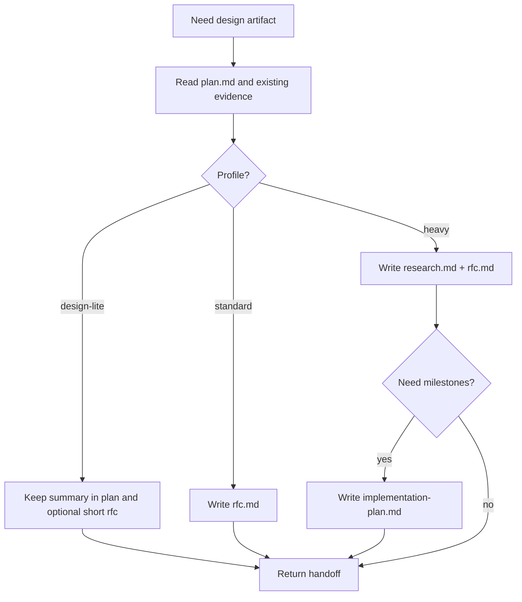

# spec-rfc

## Overview

`spec-rfc` 只负责设计产物。它不改 `.legion` 三文件，不写生产代码，也不替代 `review-rfc`。

## 输出语言与文档产物

- 默认用中文回答设计取舍、边界、验证与回滚说明。
- `docs/rfc.md`、`docs/research.md`、`docs/implementation-plan.md` 等设计文档产物默认使用中文。
- Options / Decision / Verification / Rollback 等 RFC 术语、路径、命令、API 名称、错误原文和用户指定原文保持可识别，不因中文化影响实现或审查。

## Hard Gate

- 进入前必须已有稳定 contract
- 需要的只是设计，不是实现
- 如果发现 contract 还在漂移，退回 `brainstorm`
- 只要关键 claim 需要领域能力、外部权威、延后验证或判断性决策，设计门就必须在选择 verifier 前完成验证预注册

## When to Use

- 存在 2 个以上真实设计选项
- 回滚路径、验证路径、或边界变化还不清楚
- 需要 `research.md` 摸底现状
- 需要从 RFC 抽取 `implementation-plan.md`

不要用在：

- 设计已经充分且只需实现时
- 需要对抗审查时；那属于 `review-rfc`

## Core Loop

```mermaid
flowchart TD
    A[Need design artifact] --> B[Read plan.md and existing evidence]
    B --> C{Profile?}
    C -- design-lite --> D[Keep summary in plan and optional short rfc]
    C -- standard --> E[Write rfc.md]
    C -- heavy --> F[Write research.md + rfc.md]
    F --> G{Need milestones?}
    G -- yes --> H[Write implementation-plan.md]
    G -- no --> I[Return handoff]
    D --> I
    E --> I
    H --> I
```

## Required Output

- `docs/rfc.md`
- `docs/research.md` for heavy work
- optional `docs/implementation-plan.md`

## 关键 Claim 的验证设计

RFC 必须完整读取 `../verify-change/references/REF_COGNITIVE_VERIFICATION.md`，并只为非显然、影响验收或风险判断的关键 claim 设计验证。不得在本 skill 中复制三轴、claim 状态或 attention 枚举。

对每个关键 claim，RFC 必须在 verifier 选择前确认：

- 稳定的 `claim-id`、主张文本以及它对应的验收项或风险；
- 主张性质、验证时机、专业门槛三个正交维度；
- `domain-id`、`required-capability` 与 `required-method`；
- 所需原始证据、`criticality`、`risk-if-wrong`、`blocking-policy` 与 `owner`；
- 正向验证路径、主动反例或失败路径，以及证据不足时的诚实状态；
- 需要领域 verifier 时的发现范围、真实加载方式和可重查 provenance；
- 需要 authority evidence 时的主体、资质来源、适用范围、有效期、locator 与完整性/真实性/签名校验路径；
- `deferred` claim 的触发条件、owner、届时方法、当前缓解与失败处理；
- `judgmental` claim 的选项、判断标准、价值取舍、可逆性、反方理由和 decision owner。

contract 尚未给出、但会改变目标、验收、scope 或风险接受的字段，必须退回 `brainstorm`。纯技术验证方法可以在 RFC 中补全，但补全后必须由 `review-rfc` 审查。verifier 不能在执行验证时同时修改自己的适用范围、claim 的 `criticality` 或 `blocking-policy`。

RFC 的 Verification 不能只列命令；它必须说明“哪个方法产生什么证据、该证据对应哪个 claim、什么结果分别导出哪种 claim 状态与阶段 Verdict”。低风险 `routine` claim 可以使用 reference 允许的默认值，避免制造矩阵负担。

## Must Not

- 不要把 RFC 写成实现手册全集
- 不要在这里修代码
- 不要把未确认的背景当事实写死
- 不要把领域 verifier 写成“再找一个 Agent 看看”或用多数意见代替专业能力
- 不要把未来才可观察、当前无方法和判断性观点混成同一种“不可验证”
- 不要让 claim 状态替代阶段级精确 `Verdict: PASS / FAIL`

## Return Conditions

- contract 不稳定：退回 `brainstorm`
- 需要设计裁决：交给 `review-rfc`

## Common Rationalizations

| Excuse | Reality |
|---|---|
| "先按我脑子里的方案写，RFC 后补" | 需要 RFC 的任务本来就是因为不能直接写。 |
| "只有一个方案，不用写 alternatives" | 只要存在真实 trade-off，就必须显式比较。 |
| "rollback 之后再想" | 设计门的目的之一就是提前写清 rollback。 |

## Red Flags

- contract 还没稳就开始写 RFC 正文
- 只有单一路径，没有说明为什么它优于替代方案
- verification/rollback 只是标题，没有可执行内容
- 核心 claim 缺少 `domain-id`、能力、方法、错误代价或阻塞策略，却已经指定 verifier
- authority 路径只写权威名称，没有范围、有效期、locator 和校验方法
- `deferred` 只写“以后再看”，或判断性主张仍被设计成客观 PASS

## References

- profile 定义：`references/REF_RFC_PROFILES.md`
- heavy 模板：`references/TEMPLATE_RFC_HEAVY.md`
- research 模板：`references/TEMPLATE_RESEARCH.md`
- implementation plan 模板：`references/TEMPLATE_IMPLEMENTATION_PLAN.md`
- 认知验证与领域 verifier：`../verify-change/references/REF_COGNITIVE_VERIFICATION.md`
