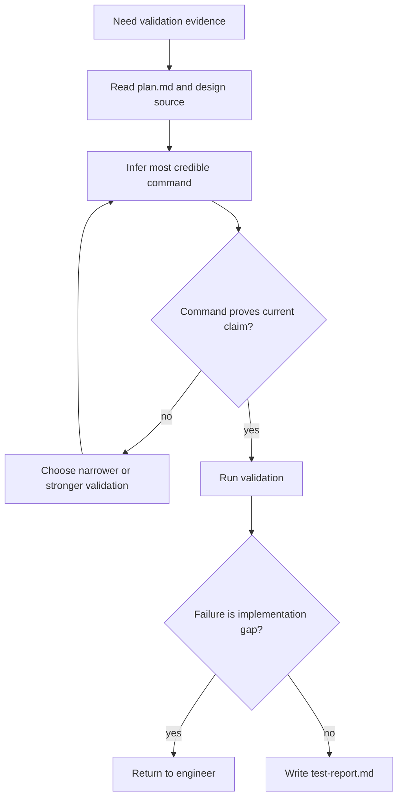

# verify-change

## Overview

验证阶段的职责不是“随便跑点命令”，而是产出可信的验证证据。这个阶段要优先找到成本最低、证明力最强的验证路径，并把结果整理成 `test-report.md`。

## Hard Gate

- 只有在实现阶段已经产生可验证改动时才能进入本 skill。
- 本阶段可以做很小的测试修复或命令修正，但**不**负责继续完成主要实现。
- 如果发现缺少设计前提、contract 不稳定、或实现明显未完成，立即退回上游，而不是在这里补设计或补大块代码。

## When to Use

- 已有代码改动，需要形成验证证据
- 需要决定先跑 targeted 还是 full validation
- 需要产出 `docs/test-report.md`

不要用在：

- 还没有实现结果时
- 需要重写设计或扩 Scope 时
- 需要 reviewer 判断 blocking 质量问题时；那属于 `review-change`

## Core Loop

## Required Inputs

- `plan.md`
- `docs/rfc.md` if present
- actual changed files or implementation handoff

## Required Output

- `docs/test-report.md`
- executed command
- result summary
- failures or skipped items
- why this command was chosen over alternatives

## Must Not

- 不要因为命令不确定就立刻追问
- 不要把验证阶段变成新的实现阶段
- 不要只写“PASS”而没有命令与证据
- 不要用和当前改动无关的大而空验证替代更直接的证据

## Return Conditions

- 测试失败且根因是实现缺口：退回 `engineer`
- 缺少可执行的验收标准：退回 `brainstorm` 或 `spec-rfc`
- 发现设计与实现不一致：退回 `spec-rfc` / `review-rfc`

## Common Rationalizations

| Excuse | Reality |
|---|---|
| "先随便跑个全量，报告里带过就行" | 验证要先证明当前改动，而不是先堆成本。 |
| "命令不确定，最好停下来问人" | 先按 CI、脚本、Makefile、语言默认路径推断。 |
| "测试挂了，我顺手把实现补完" | 大改实现应回到 `engineer`。 |
| "只要 exit code 是 0 就算完成" | 还要说明命令为什么能证明当前 claim。 |

## Red Flags

- 没读 `plan.md` 就直接跑命令
- 测试失败后开始做主要实现
- 报告里没有命令、没有失败项、没有选择理由
- 用“应该够了”替代验证依据
