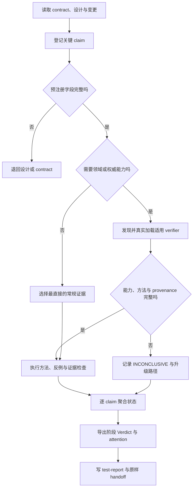

# verify-change

## Overview

验证阶段既是证据执行者，也是认知验证路由器和证据聚合器。它先识别真正影响验收或风险的 claim，再选择成本合理、证明力足够的常规方法，或真实加载适用的领域 verifier；最终把客观结果、证据不足、延后事项和判断建议分别如实记录到 `docs/test-report.md`。

本阶段不得用通用模型自信、多个 Agent 的一致意见或一句“已加载专家”填补专业证据缺口。

## 输出语言与文档产物

- 默认用中文回答验证选择、结果摘要、失败/跳过项、专业证据限制和交接结论。
- `docs/test-report.md` 等验证文档产物默认使用中文。
- 命令、exit code、测试名、日志片段、错误输出、路径和机器可读字段保持原文，必要时在中文正文中解释其证明力。

## Hard Gate

- 只有在实现阶段已经产生可验证改动时才能进入本 skill。
- 进入后必须先读 `plan.md`、存在的设计真源和实际 changed files / implementation handoff。
- 必须完整读取 `references/REF_COGNITIVE_VERIFICATION.md` 与 `../legion-workflow/references/REF_HUMAN_ATTENTION.md`，不得凭记忆复制其中的枚举或映射。
- 关键 claim 若缺少 verifier 选择前必须确定的预注册字段，立即退回 `spec-rfc -> review-rfc`；若缺失会改变目标、验收、scope 或风险接受，退回 `brainstorm`。
- 本阶段可以做很小的测试修复或命令修正，但不负责继续完成主要实现。

## When to Use

- 已有代码或协议改动，需要形成可复核的验证证据
- 需要决定先跑 targeted 还是 full validation
- 关键 claim 需要按领域、能力与方法路由 verifier
- 需要区分当前可证、证据不足、延后验证和判断性建议
- 需要产出 `docs/test-report.md` 与会话注意力摘要

不要用在：

- 还没有实现结果时
- 需要重写 contract、设计或扩 Scope 时
- 需要 reviewer 判断 blocking 质量问题时；那属于 `review-change`

## Core Loop

```mermaid
flowchart TD
    A[读取 contract、设计与变更] --> B[登记关键 claim]
    B --> C{预注册字段完整吗}
    C -- 否 --> D[退回设计或 contract]
    C -- 是 --> E{需要领域或权威能力吗}
    E -- 否 --> F[选择最直接的常规证据]
    E -- 是 --> G[发现并真实加载适用 verifier]
    G --> H{能力、方法与 provenance 完整吗}
    H -- 否 --> I[记录 INCONCLUSIVE 与升级路径]
    H -- 是 --> J[执行方法、反例与证据检查]
    F --> J
    J --> K[逐 claim 聚合状态]
    I --> K
    K --> L[导出阶段 Verdict 与 attention]
    L --> M[写 test-report 与原样 handoff]
```

## Required Inputs

- `plan.md`
- `docs/rfc.md`（若存在）
- `docs/review-rfc.md`（若存在）
- 实际 changed files 或 implementation handoff
- contract / RFC 中的关键 claim 预注册
- 当前会话可用的 skills catalog 与仓库内 verifier 声明（存在领域 claim 时）

## 执行流程

1. 从验收、风险、设计与实际 diff 中提取关键 claim。只登记非显然且会改变验收或风险判断的主张；低风险 `routine` claim 可以按认知验证 reference 自动生成合理默认值。
2. 逐项核对预注册的三轴、`domain-id`、`required-capability`、`required-method`、所需证据、`criticality`、`risk-if-wrong`、`blocking-policy` 与 owner。验证者不得自行降低阻塞级别或扩大自己的适用范围。
3. 对常规 claim，优先选择与当前改动直接对应、成本最低且证明力足够的命令、静态约束或实验；说明为何它优于更大但更空的检查。
4. 对 `domain` 或 `authority` claim，严格按认知验证 reference 的顺序发现候选 verifier。候选必须同时覆盖预注册的领域、能力和方法；名字相似不算匹配。
5. 选中 verifier 后，完整读取其 `SKILL.md` 和全部必要 reference，实际执行规定的方法，并保存可复核 provenance。调用 sub-agent 不会自动提高独立性；独立性必须由证据来源和上下文隔离事实说明。
6. 主动运行正向路径、反例、失败路径或替代解释。作者总结只作为待验证输入，不能作为独立证据。
7. 对 authority evidence 校验主体、资质来源、范围、有效期、locator 与完整性/真实性/签名；对延后和判断性主张执行认知验证 reference 的专门协议。
8. 为每个 claim 记录状态、证据映射、独立性、置信度、残余不确定性和失效条件。领域 verifier 缺失、未真实加载、provenance 不完整或 authority 校验失败时，只能记为 `INCONCLUSIVE` 并给出真实升级路径。
9. 按认知验证 reference 聚合独立的阶段级 `## Verdict`，其下一有效内容只能是 `PASS` 或 `FAIL`。claim 状态不得替代阶段 Verdict。
10. 按所有未解决 claim 的最高 attention 写入 `## 会话注意力摘要`。摘要必须遵循统一 attention reference，关键发现最多三项；sub-agent handoff 原样返回该小节，由 orchestrator 在派生下一阶段前直接投影给用户。

## Required Output

- `docs/test-report.md`
- 验证范围与选择理由
- claim 预注册字段、状态及其与验收/风险的关系
- 执行命令或工具调用、关键参数、exit code / 结果标识与原始输出 locator
- 领域 verifier 的匹配、真实加载、统一返回内容和完整 provenance；不适用时明确说明
- authority evidence 的正向校验或负向缺口；不适用时明确说明
- `DEFERRED` / `RECOMMENDATION` 记录；没有时明确说明
- 失败、跳过项、残余不确定性与证据失效条件
- 独立的 `## Verdict`，值为 `PASS` 或 `FAIL`
- 内嵌的 `## 会话注意力摘要`
- 最终 handoff 原样返回会话注意力摘要，不用“详见文件”替代关键结论

报告的具体结构、claim 状态映射、provenance、authority 正负路径、延后协议和判断性主张规则只以 `references/REF_COGNITIVE_VERIFICATION.md` 为准。

## Must Not

- 不要因为命令或 verifier 不确定就立刻追问；先按 contract、CI、脚本、catalog 和仓库声明发现候选
- 不要把验证阶段变成新的实现阶段
- 不要只写“PASS”而没有命令、原始证据和 claim 映射
- 不要用和当前改动无关的大而空验证替代更直接的证据
- 不要把多个 Agent 的共识当作领域能力、独立证据或外部权威
- 不要只写“已真实加载 verifier”而缺少可重查 provenance
- 不要把“以后再看”写成 `DEFERRED`，也不要把观点写成客观 `PASS`
- 不要为了保存原始输出而复制秘密、令牌、个人数据或其他敏感信息
- 不要临场降低 `criticality`、`blocking-policy` 或 attention

## Return Conditions

- 测试失败且根因是实现缺口：阶段 `FAIL`，退回 `engineer`
- 缺少可执行验收或 contract 关键字段：退回 `brainstorm`
- claim 分类、验证设计或实现边界有误：退回 `spec-rfc -> review-rfc`
- 领域 verifier、authority、权限或运行条件缺失：记录 `INCONCLUSIVE`，按预注册阻塞策略导出 attention 与升级路径，不得伪造结论
- 关键判断尚无 owner 决定：记录 `RECOMMENDATION`，阶段与 attention 按认知验证 reference 处理
- 验证证据完成：交给 `review-change` 进行只读重查

## Common Rationalizations

| 借口 | 事实 |
|---|---|
| “先随便跑个全量，报告里带过就行” | 验证要先证明当前 claim，而不是先堆成本。 |
| “找不到专业 skill，通用模型也懂一点” | 能解释不等于具备预注册能力；缺失时必须 `INCONCLUSIVE`。 |
| “两个 Agent 都同意，可以提高置信度” | 共享输入和上下文的一致意见不是独立证据。 |
| “写了 verifier 名称，reviewer 应该相信已加载” | 没有 locator、摘要、执行记录和原始输出映射就不可复核。 |
| “测试挂了，我顺手把实现补完” | 大改实现应回到 `engineer`。 |
| “只要 exit code 是 0 就算完成” | 还要证明命令覆盖当前 claim，并记录反例与残余不确定性。 |

## Red Flags

- 没读 `plan.md`、设计真源和两个必需 reference 就开始跑命令
- 核心 claim 没有预注册领域、能力、方法和错误代价
- verifier 自己选择自己或修改 claim 阻塞级别
- 报告没有原始证据 locator、provenance 或 claim 映射
- authority evidence 没有范围、有效期或校验结果
- `DEFERRED` 没有 owner / 触发条件 / 届时方法
- 用 `RECOMMENDATION` 直接满足 objective / formal 验收
- 阶段 Verdict 被 claim 状态表替代
- handoff 只给路径，没有会话注意力摘要

## References

- 认知验证与领域 verifier：`references/REF_COGNITIVE_VERIFICATION.md`
- 人类注意力交接：`../legion-workflow/references/REF_HUMAN_ATTENTION.md`
- 下一阶段：`review-change`
